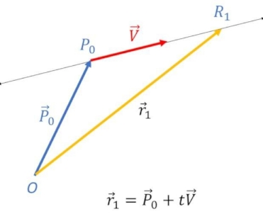

This is intended to be the "Introduction to Mathematics". I'll go over the following syllabus:

- **Algebraic Math**: *Real Number; Arithmetic; Identity of Fractions; Vector Algebra; Coordinate Systems; Matrices; Normalization; Systems of Equations; Set Theory; Expression; Logarithm; Identity; Linear; Polynomial; Quadratic; Signum; Piecewise; Parametric; Exponential; Rational; Logarithmic; Inverse; Periodic; Sigmoid; Parabola; Sine; Hyperbolic; Gamma; Transfer Function; and more*

- [**Matrix Multiplication**](matrix.md): *Experimenting with the best way to illustrate matrix multiplication*

- [**Midian Larune**](midian.md) *Category Theory; Rational Trig: States, Spreads, Quadrances, Reciprocal Properties, Isometric Transformations; Complex Numbers; Lie Groups; Quaternions*

- **Geometry**: *Scalar, Vector; Plane & Solid Geometry; Transformation; Geometric Primitives; Affine & Projection Matrices, Perspective Projection*

- **Calculus**: *Vector Calculus; Differential Equations; Derivatives; Integrals; Limits; Tangent/Area Math Problem*

- **Logic**: *Reasoning and Proof*

- **Waves**: *Wave Propogation; Wave Fronts; Wave-Based Algorithms; Wavelets; Anything Wave-Related*

- [**Symbols by Subject**](glossary.md) *This page I have created is a glossary of some of the mathematical symbols we'll be using, using the basic multilingual plane (plane 0) utf-8 encoding.


**About this document**: Please note, that the `^` symbol can be used to represent *"to the power of"*, or `XOR` in programming, and in the case of the ladder situation, i'll use specifically `⊕` and that way you always know what i mean. In certain cases, like for separating variables from numbered subscripts, I omit the `_` underscore, seeing as it looks more elegant that way. When a variable and a value are being multiplied and use adjouring characters `xy`, I will explicitly rewrite it as `x*y` so you know it is for said operation, and not the character and subscript. The other option is to put `()` around the actual term or number, which then can be a way of separating two adjoining terms, without needing `*` explicitly said. In situations where there is actually two adjoining letters to indicate a term and a subscript together, I may separate them with an underscore, but I will likely write it as e.g. `x'`, `x1` or `xy` (**KEEP THIS IN MIND**)

What is mathematical **notation**? It is a system of symbols and conventions used to represent objects and operations.

**Scalars** (*s*) are quantities that are fully described by a size (numerical value), without any associated direction. Scalars can be represented by whole numbers or real numbers, providing a comprehensive selection of possible values to describe magnitude without regard to direction (a scalable value). Where the term "number" represents mathematical objects in a generic sense, scalars on the other hand represent a subset of numbers that are specifically used to describe quantities. In the same way, multiplication and division are operations that specifically work w/ groups.

Note: Natural numbers (ℕ) and integers (ℤ) are both subsets of real numbers (ℝ), and whole numbers are usually a terminology variation of natural numbers depending on the definition being used.

**Expressions** are things like `4*3-2` or `4*3-y`, where you only have enough information to know the relation between said variables and values. An expression doesnt directly make any inference about equality, if that makes sense. When we talk about *order of operations*, we can demonstrate how expressions are easier to solve when you use parentheses to show a clear delineation and progression from its original state, to the answer (assuming its an expression that is suppose to have an answer)

**Variables** sometimes called a "term" or "value", are used to represent **unknown quantities** or parameters in mathematical expressions or equations. For example, in the equation `ax+b=0`, `x` is a variable representing an unknown value, while `a` and `b` may be considered the constants (depending on the situation). **Constants** have a specific, fixed value that does not vary within the scope of a problem. `π` is one such example. `ax+b` is an expression(or polynomial), and `ax+b=0` is the equation (more about equations and expressions as polynomials later)

In an algebraic expression, **coefficients** are the numbers that multiply the variables or terms. For e.g. in (`3x`), the number 3 is a coefficient.

**Fractions** are mathematical expressions representing parts of a whole or ratios between two quantities. They consist of a numerator and a denominator separated by a horizontal line, commonly known as the fraction bar. The numerator signifies the **number of parts being considered**, while the denominator represents the **total number** of equal parts into which the whole is divided. Conceptually, fractions also represent a division operation, where the numerator is divided by the denominator. This implies that a fraction can be interpreted as the result of dividing a whole into equal parts, with the numerator indicating how many of those parts are being considered. The terms "divide by" and "divided by" always implicates the denominator—so if I say *"a number divided by 99"* then I mean `number / 99`. Pretty simple.

We are going to explain division and how fractions work with different operations.

The Identity of Fractions: We need a concise way to recognize the following idea. Lets call this concept or rule "The Identity of Fractions": `x = x/1`, and it is saying that any number or variable can be rewritten as itself over `1`. This rule highlights the inherent flexibility in the way we represent numbers, and it’s especially useful when working with fractions or algebraic expressions. Therefore the value of the number doesn't change when you rewrite it this way.

Not only can `x` be rewritten as  `x/1`, but also  as  `x^(1)` , which we may refer to as being in exponent form. We'll talk more about these identities and forms again later, as we frequently need to rearrange terms and expressions.

Moreover, fractions themselves can be converted into decimal form after performing the division operation (for decimal representation) Each decimal place on the left is `10^n`, or `10^-n` on the right, therefore multiplying by `10^n` displaces the decimal point to the right. For example, in scientific notation: `3.5 × 10^4` represents `35,000`, where you'd move the decimal point to the right, effectively adding decimal places to the left of it.

To verify a conversion from fractional to decimal, take the example `3/4`, which you know has to be less than zero. Consider each decimal place value after "0". In `0.00`, the ".0" is in the tenths place, and the ".00" is in the hundredths place. So, if we chose (0.75), it represents (7 tenths) and (5 hundredths). In fraction form, this is `7/10 + 5/100` (now you have to multiply both parts of a fraction by the same number in order to compare it to the opposing operand, (`7*10/10*10`)... so we're left w/ `70/100 + 5/100 = 75/100`. To reduce or simplify the fraction `75/100`, you divide both parts by the greatest common divisor which is `25`, and you get `3/4`, meaning your answer was right, `75%`. We typically use the rules of long division for numbers (parts) that do not divide evenly, which we will talk about later on.

Alternatively, to convert it from fraction to a percent you could do `3/4 * 100%` (or `3/4 * 100/1`) which equals `300/4`, and is in fact (`75`) or 75%. Theres more than one way to think about fractions (division)

Just a quick example for applying a proper or improper fraction to `x` (we could also call them upside-down or rightside-up fractions, which both abide by the following rule): Consider that `x ⋅ a/b` is the same as `(a⋅x)/b`. That is, you multiply `x` by the numerator, then divide the result by the denominator. Now, if you instead multiply by the denominator and then divide by the numerator, that’s: `x ⋅ b/a`. Which is the reciprocal of the original fraction: `x ⋅ (a/b)^-1`. So you're now multiplying `x` by the denominator first, then dividing by the numerator (inverse of multiplying by `a/b`)

Subscripts are **small characters** or numerals positioned slightly below the normal line of text. They are typically used to denote indices, labels, parameters, or specific elements within a mathematical expression.

Prime symbol (the apostrophe, e.g. `v1'`) pronounced *v1 prime*, can mean its a related-modified version, as well as within a certain order of derivatives and so forth.

**Super**scripts are small characters or numerals positioned slightly above the normal line of text or script. They are commonly used to denote exponents, powers, or other elevated quantities in mathematical expressions.

**Operators** are symbols or functions that represent **mathematical operations** or **transformations* on one or more operands to produce a result. Operators are fundamental to mathematical expressions and equations, and allow us to perform various calculations and manipulate quantities. If you havent yet memorized all your "times tables" w/ multiplication, no worries. Alot of people have never learned them, and continue to later in life. Your two most basic operators are **arithmetic** and **comparison operators**. Comparison is a broader term that includes **equality** and **inequality**. An inequality is a mathematical statement that compares two values or expressions using symbols like: < (less than), ≤ (less than or equal to), > (greater than)  and  ≥ (greater than or equal to). Similarly, equality uses `=` to show that two expressions are the same, and inequality uses `≠` to show that two expressions are different (not equal).

A wavy *"equal to" sign* (≈) represents **"approximately equal to"**.

**Order of operations** in math is typically remembered using the mnemonic PEMDAS, which stands for the following:
1.  (P)arentheses
2.  (E)xponents
3.  (M)ultiplication ⊕ (D)ivision
4.  (A)ddition       ⊕ (S)ubtraction

BUT, as you see — "MD" and "AS" aren't strictly in order, meaning that you dont enforce *multiplication before division*; And nor do you enforce *addition before substraction*. You simply go by **what comes first within (M)⊕(D)** and then, **what comes first within (A)⊕(S)**, starting from left to right (the notion of from left to right is important, and in fact we'll be explaining the history-dependent ramifications later on). This is the sequence in which operations should be performed in expressions. Here is an example that shows the clear progression going from expression(s) to answer:
```
 4 / 2 - 2 * 3
(4/2) - 2 * 3
  2   -2 * 3
   2  - 6
   = -4
```
Now, when it comes to this PEMDAS rule, its not so much a rule, more than it is a **guide**. And I say that because its not always the case that you solve equations purely in the land of "PEMDAS". And this becomes much more evident when we start looking at how to solve expressions and equations via distribution and through other such methods. But i digress.

**What is the absolute value?** and **what is the reciprocal of x?**

The **absolute value** (specifically of a **non-positive** number—negative or zero) is the **positive** version of that number.

The **reciprocal** of a number is simply its multiplicative inverse. (i.e. reciprocal of `3` is `1/3`) In other words, for a nonzero number `x`, the reciprocal of `x` is
`(1/x)` or equivalently, `x^(-1)`. You can internalize that by thinking of how **any number `x` is the same as writing `x/1`**, and as such, the reciprocal is the **upside-down** version.

Addition is the process of adding two numbers together, and the result is called the **sum**. Subtraction is the process of "taking away" one number from another, and the result is called the **difference**. Multiplication is the process of adding a number "that many times" to itself and is called the **product**, *(in the same way an exponent represents the multiplication of a number "that many times" to itself)*. Why is any number `n` times 1 equal to itself?... Well lets look at what happens in addition. For addition, any number plus 1 is 1 more than that number, so you know that you cannot have, (1*n) of any number equal to one more, simply because that is effectively the same as adding 1, you also know multiplication works w/ groups, therefore `1*n` or `n` can be rewritten as "1n" together (note: anytime we have multiplication, we will be have the operator symbol expressed explicitly in between the terms). Multiplication is in fact the same as saying "one of this kind of group".

Multiplication is interesting because it creates repeated patterns of numbers and sequences within the equations. Mathematics works on recognizing patterns.

Division is the opposite of multiplication. It represents **taking away a number** that many times, and the results called the **quotient**.

Division is the same as **multiplying by the reciprocal**. For example, `6/4` (which is a 6 divided by 4)
It can be rewritten as `6 * 1/4` (which is NOT the same as a mixed number, which means `6 + (1/4)`, which is obviously a different operator relationship)

Why does this work? Take the reciprocal of 4 or 4/1 (which is the same thing), and you get `1/4`... Now, `4 * 1/4 = 1`

We can make a general formula of this; For any numbers `a` and `b`, then `a÷b = a × 1/b`

There's a hidden property: `A + B / C = (A/C) + (B/C)`

And here's yet another way to illustrate this: `1/x+a / a` (or it can be written as `(1/x)/a + a/a`) because `1/(a*x) + 1`; then we can rewrite it as `(1/a)*(1/x+a - 1/x)`, wherein the parentheses it becomes `(1/x + a) - 1/x`. The `1/x` terms cancel each other out, leaving just `a`, and simplified it becomes... `1/a * a`... or the answer `(1)`

If you're having trouble following me, just humor me for now and comeback to if after we've gone through some of the fundamentals of equations and how to solve them.

And, if you are curious about long division, see my page on [long division here](division.md)

**Equations** are mathematical statements that express equality between two expressions. For example:
```
x^2 − 4 = 0
```
This is an equation, and it describes a condition. This condition or expression can be further solved, specifically for the value `x`.
In this case, `x = ± 2`, wherein `x` is equal to BOTH negative 2 and positive 2, but not both at the same time unless it is being solved in a much different context, that looks for simultaneous answers.

Often, when solving for an equation, we focus on manipulating one side to **isolate a variable**. The goal is still to find the relationship between the two sides. Lets say for example, in the equation `3x+5=11`, we might subtract  5  from both sides to isolate  the  `3x`  term, ultimately solving for  `x`

Sometimes the goal is to explore the relationship itself. For example, consider the equation  `y=mx+b`  (a linear equation). The relationship between `x` and `y` is defined by the slope `m` and the y-intercept `b`, and you might not be "solving" it in the traditional sense, but rather using it to understand how `y` changes as `x` changes. In this case, it's about the relationship between the two sides of the equation.

Sometimes, you might have the right side of an equation but need to reverse-engineer or **work backward from the solution** to deduce the input or conditions (like in an optimization problem) This is often seen in systems of equations or inverse functions. Specifically in systems of equations (or working w/ multiple equations simultaneously), we’re looking for relationships that satisfy all equations in a system. The LHS and RHS interact across multiple equations, and the solution is typically the values that satisfy all these relationships simultaneously. Though you cant always rely on the LHS and RHS of an equation, and what the rules were of a prior equation...

The rules governing each side of an equation do not always carry over into other problems. And therefore, it is the context of what you are doing that is the most important, the most integral to moving forward—the primary component that you are basing all your intuition on in order to advance the narrative behind that particular set of steps or equation(s).

The terms **algorithm** and **equation** are sometimes used interchangeably, however I think of *algorithm* as more of a **list of steps to perform**, or the closest to a native routine (but often written in **an algebraic form**) in contrast to an **equation** which I often associate directly with algebra, or a more flexible/modular type of formula. Im using the term **formula** here to represent "a method that relies on established models". There are other kinds of perspectives and terms to look at, but lets save ourselves the trouble of getting stuck in the muk of semantic meanings and such.


**Squares and Triangles**: What is a square? In simple terms, its **one side length** times **another side** (which equals its "area"), however squares are a bit weirder than you might initially think. They have sides that all depend on one another, 4 times or P = Side (4 xtimes). When we think about shapes we consider the dependency of those sides, and so if one side changes then an equal and opposite change will happen to the others. If one side changes and we dont change the others then we are changing that shape entirely. This rule is true as well when we talk about shapes that live on the 3D place, that which have faces that each depend on one another (more on geometry later) In conclusion, squares are very weird. This also shows you that things are not entirely straightforward when it comes to compatibility between vertices.

A vertex (plural: vertices) is a point where two or more lines, edges, or curves meet. It is the corner of a geometric shape. A triangle has 3 vertices. A square has 4 vertices. When you square a number, you’re essentially finding the area of a square with side length equal to that number. Take the example of `(3)^2`. This can be seen as the area of a square with side length "3". So, `Area = side * side`, which is another way to express `1 side, 4 xtimes`

And just so its clear, an edge typically refers to **a line segment connecting two points**, especially in geometry, graph theory, or 3D modeling. For example, in a cube, the edges are the lines between vertices, but in a graph, an edge is a connection between nodes. A vector, though, is a single entity—an arrow with a direction and length—not a structure made of multiple segments. The vector itself could be thought of as a directed "edge" in some contexts, but its ends aren’t edges; they’re just points (we'll elaborate on true vectors and pseudo-vectors later on...)

**The difference of squares**; this is an important rule to understand for things like factoring. Its used to simplify algebraic expressions and solve for unknowns. For example, `x^2` is a square: `(x)^2`.  And the number `4` is a square: `(2)^2`. Since it matches the form `a^2 - b^2`, you can apply the difference of squares rule: `x^2 - 4 = (x - 2)(x + 2)`. We should explain what factoring distribution are..

**Distributive Property**: Distribution is the process of applying a term outside of parentheses to each term inside the parentheses. It's usually portrayed as `a(b + c) = (a*b) + (a*c)`, which means that both sides in the expression are considered **equal**, and can thus be converted or represented by either the left hand (LHS) or right hand side (RHS). However the distributive property is exclusive to the addition and subtraction of those variables.

If you have `3(x + 4)` (or `((3) * (x + 4))`, you distribute the `3` to both `x` and `4`, giving you: `3(x + 4) = (3*x) + 12`. The same is true for the reverse, moving the coefficient outside, etc...

**Factoring** is the reverse of distribution, as it is the process of **breaking down an expression** into simpler components (called **factors**).

If you have `3*x + 12` (I wrote it differently for the sake of variation), you can factor out the common factor of `3`, which gives: `(3*x) + 12 = (3*x) + 4`

**Principle of equality**, is when you perform operations on **both sides of the equation** through a technique that shares an equal but opposite relationship, in order to isolate variables or simplify an expression, preserving the truth of said equation. More specifically, it means any operation performed on one side of the equation must also be performed on the other side to maintain said equality. Suppose we have the example: `x = (a - b)/y` ... We can rearrange this equation, first by multiplying both sides of the equation by `y`:

`x*y = a-b/y * y`

On the right-hand side, `y` in the numerator and `y` in the denominator cancel each other out:

`x * y = a − b`

So, using the principle of equality, the equation `x = a−b/y`, becomes `x*y = a−b`

If `x + 3 = 7`, and you subtract `3` from both sides, you get `x = 4`
If `2*x = 10`, and you divide both sides by `2`, you get `x = 5`

**Exponent**

When you see `^` and an adjoining number or term, it refers to the repeated multiplication of some number by itself (raising a number to a certain exponent or "power") For example, in the expression `a^n`, `a` is the base and `n` is the exponent, the result is the nth power of `a`.

When you have the expression `x/y` it can be rewritten as `x * y^(-1)`, which is equivalent to `x * y^(1/-1)`... If you consider the denominator as `x^(1/n)`, then `n = -1`.

You can also **undo** an exponent in equations that have an exponent that's 2 or greater, e.g. `x^2 = 4`, you take the square root of both sides, wherein it becomes `x ± 2`. And, `x` can be either `x=2` or `x=−2`, since both satisfy the equation when squared. We'll have more examples later where you "solve for x".

**Square Root**

The square root (√) of a number `x` is a value `y` such that: `y^2 = x` is also true; This defines the **inverse operation** of the square root (a keystone square root operator) which is applied when the square root operator is moved to the opposite side of the equation. The square root operation (or function) finds the number, that.. when squared, gives the original number. For example: `√9 = 3` because `3^2 = 9`... or `√25 = 5` because `5^2 = 25`

We can use "sqrt{}" (which is what we'll use to notate square roots). Now, take the following example; Say we have a base power `2` of a number `x`. That would look like `2^x`. This expression is the same as `x^(1/2)` **as well as writing** `sqrt{x}`, because `x^(1/2)` is equivalent to the "natural" square root of `x`. It is simply the principal square root.

No further terms or modifications are needed. However, the **order of operations** matters or else you'd have `(1^1)/2`, hence it is preferred to use square root notation for this situation; Although it is easier to think in terms of **some power of a fraction** in certain places. This resonates w/ other pre-arranged expressions that we'll be going over...*

**n log(x)**

The opposite of `n log(x)` is to raise the base `x` to the power of `1/n`, which is written as `x^1/n` This operation is often referred to as taking the nth root of `x`... Logarithms can be expressed as `log b(n) = x`, where `b` is the base, `x` is the exponent to which the base must be raised to produce `n` (i.e. the number being operated on)

So you can have for e.g. `log2(8)=x`, which means you're finding the exponent to which `2` must be raised to produce `8`. In this case, `x` would equal `3`, i.e. `2^3 = 8`

**x mod(y)**

Modular aerithmetic, which is a mathematical concept where you take the remainder after a division by a certain number (the modulus) can be written as `x mod(y)` — illustrated when `x` is greater than or less than `y` as e.g.

`10 mod(3)`, `3` goes into `10` (3x), `3 * 3 = 9`, and `10 - 9` = The answer: `1`

`4  mod(7)`, `4` goes into `7`  (0x), `0 * 7 = 0`, and `4 - 0` = The answer: `4`

Any number modulo `0` is undefined. Division by `0` is undefined in mathematics as a rule.

Any number modulo `1` is always `0`. This is because dividing any number by `1` always results in that number with no remainder.

Any even number modulo `2` is `0`. This is because an even number can be divided evenly by `2`.

And any odd number modulo `2` is `1` which is because, dividing an odd number by `2` you get a quotient of `0` with a remainder of `1`.

Therefore modulus addresses different components of the division process, what the remainder is.

Odd numbers are integers that are not divisible by 2, while even numbers are integers that are divisible by 2. Therefore, because they span the entirety of all real numbers (forming the basis for divisibility and parity concepts in arithmetic) one could exploit this to understand deeper relationships as well as find patterns and befitting algorithms.

**Prime numbers** are another such example. Prime numbers are integers **greater than 1** that have exactly two distinct positive divisors: ***1 and themselves**. They are the building blocks of the integers, as every integer greater than 1 can be uniquely expressed as a product of prime numbers, a concept known as the Fundamental Theorem of Arithmetic. Prime numbers are of central importance in number theory and other such fields.

**Geometry**

Geometry is the study of shapes, sizes, relative positions of objects, and the properties of space. It is concerned with understanding the relationships between points, lines, angles, surfaces, and solids, as well as the properties and measurements associated with them.

**Congruency**: Two shapes are congruent if they have the **same size and shape**. Technically speaking, it's when one can be transformed into the other by rotation, reflection, or translation (moving, rotating, or flipping the shape) which is something we'll talk more about later on. You can also have congruent angles and line segments. Two angles are congruent if they have the same measure. Two line segments are congruent if they have the same length.

The study of polygons (flat faces), polyhedrons and Platonic solids (the 3D crew), and polytopes (the higher-dimensional weirdos) is a funky corner of geometry. It's not just about the abstract, **representational side of math** anymore, once we start to pin point the **exact geometric properties of shapes**, and higher order objects. Its more determined to say something about the **specifics of a shape**. Although in modeling tools and other such graphics-related areas, its essential to acknowledge geometry in a geometric way. Usually, we dont have a good way to talk about geometry, and then once we learn more about geometry in actual mathematics, we find that there isnt a good way to talk about objects that go beyond the five platonic solids. So that goes to show you one of the **specific disconnections** in math, and where we might need to start thinking in our own way sometimes.

This of course doesnt end with geometry, but its something to keep in mind as you go on. Therefore, you shouldnt assume that mathematics has everything figured out, and youd be surprised to learn how limited mathematics is in general. For example, you might discover that, in alot of cases its more natural to talk about triangles, squares and cubes more than anything else, and as such, alot of our representational tooling is based around squares and cubes. And even when we extend mathematics to create or connect new systems, it always remains incomplete in some way, even if we might not know it. The natural dilemma we face is **the current state of mathematics**, and whether our contemporaries required a more *elaborate* realization or not.

And just to give a brief window into the history of the polymaths of our generation, and how certain fields and ways of thinking come together: A polymath is an individual who possesses a wide range of knowledge and skills across multiple disciplines, often blending insights from math, art and the sciences; As well as humanities, philosophies, engineering, and beyond to approach problems with creativity and depth. Polymaths have played transformative roles in the realm of mathematics. Take, for instance, historical figures like Archimedes—seen in his work on geometry and calculus-like methods—intersected with his engineering feats. His ability to apply mathematical rigor to real-world problems exemplifies how polymaths amplify the impact of math beyond theoretical confines. Similarly, René Descartes, known for his philosophical treatises, revolutionized mathematics with the development of coordinate geometry, linking algebra and geometry in a way that reshaped scientific inquiry. We'll talk more about Descartes later, because he's really a crucial part of this story.

Just to throw out some other terms associated w/ higher areas of Geometry—that are probably outside of the realm of what we can speak on: Manifolds, Isometry (to preserve distance and shape in the study of symmetry), a chord—a line segment connecting two points on a curve, a conic section, a geodesic (the shortest path between two points on a curved surface), antipodal points (pairs of points on, or within a sphere—that are connected by a straight line through the sphere's center, aka **opposite points**), convex, concave, haversine function, arc length and polar distances. A UFO or flying saucer would be "oblate", a pill or a blimp is "prolate" in describing a kind of **ellipsoid**. Where as, we would say something is **oblong** if its a 2D, oblong shape (note: "Oblong" isn't typically used to describe egg-shaped things because of their asymmetry, so an oval or "ovoid" is not oblong in some sense)

I believe that, a better introduction to higher geometry or spheres is the **study of relationships**, parameters, or other geometric attributes. For example, consider that something can be linear or curvilinear if its either a perfect circle or a perfect spiral—either centrifugal (outward) or centripedal (inward) (in the representational sense). However, once it enters the realms of an elliptical and/or an ellipsoid, it no longer exhibits qualities you can easily consider linear. "Elliptical" describes something having the shape of an ellipse (a two-dimensional oval curve). An Ellipsoid is a noun referring to a three-dimensional object that resembles a stretched or compressed sphere. Thats just one observation you can make, as I was trying to draw a parallel between—how a polymath might think in the fields of mathematics and geometry.


**Multiply Fractions**

When adding or subtracting fractions with different denominators, the first thing you need to do is find a common denominator. This means finding the smallest number that both denominators can divide into evenly, known as the least common denominator (LCD). Once you have the LCD, you need to adjust each fraction so that both fractions have the same denominator. You do this by multiplying both the numerator and denominator of each fraction by whatever number is necessary to make the denominator match the LCD.

After both fractions have the same denominator, you can proceed to add or subtract the numerators. You add or subtract the top numbers just like regular addition or subtraction, and you keep the denominator the same.

You only need a common denominator when **adding** or **subtracting** fractions, not when multiplying or dividing them. For multiplication it is even simpler. You multiply both numerators and both denominators, and that's your answer. Therefore, for multiplication specifically you can multiply across the numerator and denominator, regardless of.

Dividing fractions is a little different. In the case of dividing fractions you have to perform a specific step before hand. Technically speaking, you would be **multiplying by the reciprocal** (a flipped version) of the second fraction in the equation. This means you flip the second fraction upside down and then multiply it by the first fraction. So the following illustration means that, both expressions (right and left side) are EXACTLY equivalent to each other:
```
(a/b) * (c/d) = (a*c) / (b*d)
```
Example: `(2/3) / (4/5)` . First flip the second fraction (`4/5`) to get its reciprocal (`5/4`). Using this to multiply it with `2/3`, you get your answer!

Of course, I dont want to just explain how it works, but rather I want to demonstrate just how often fractions appear in real life scenarios, and the subsequent ways they are used.


**A neat little math scenario** (scaling behavior)

Here's a neat little math scenario. Let's say that we have two images: IMG**A** : 700x394, and IMG**B** : 1920x1272... They're kindve awkward dimensions, but they're not too bad. We can work w/ them. We want to embed them into our website. When we do, the second one appears slightly larger (in width) on top of the first image, and it looks sloppy to us. So we decide to resize the second one, such that it has the same width has the first. The only stipulation is that we have to make sure that the height scales to the downsizing of the width, such that it doesnt skew, i.e. vertically skewed (horizontally stretching is sometimes called warping or distorting)

Anyway, there is a simple algorithm that can help us with these calculations (Note: we are gonna call the `w * h` of the second image the "original" width and height, because the first image has our actual **intended** dimension (`intended width`), makes sense right?
``
new height = (intended width / original width) × original height
``
So if we take 700 over 1920 we get a decimal number (something like `0.364`), and if we take that a multiply it by the original height 1272 ...
new height ≈ 464 (you want a whole number in this case, because there's no decimals in image sizes. It just has to be an approx. pixel dimension)

So we can kindve generalize what this means:

"Anytime you have an **intended width**, and you need to make the original image's width the **same as the intended width**, you take the intended width **over** the **width you want to be changed** (the other images width) and depending on whatever the quotient is, that quotient is multiplied into the other image's **height** (such that it properly scales)"

Knowing how this scaling behavior works is IMPERATIVE!

An alternative way to solve this is to write it like this....

`new height = intended width/1 × (1 / original width) × original height/1`

So thats very different, because you can just multiply all of the numerators together once you have plugged in the numbers, i.e.

`new height = 700/1 × 1/1920 × 1272/1`

Then, you're left w/: `889,600 / 1920` ... Wherein dividing that into the denominator will get you the very same answer. Pretty cool right?

The second is is atleast a whole even number. If you dont have a calculator or a programming language to do the division of these, the superior way to divide is using long division, which you can learn how to do by viewing my other page, [division.md](division.md)

I find that scaling (making sure that something is proportional to another item) is very common and crops up in ALOT of different places.

We could even take this further to explain the **average rate of change** that occurs as we change one images width, in relation to the other's height (just for demonstration purposes), which implies a "slope" between two points. This is how you measure the rate of change over a finite change in width. Derivatives are slightly different, and we'll talk about them later.

> This point marks the end of the fundamental basics. That's not to say that there's not very important concepts and principles that may appear after this line.
____


**Modulus Illustration** (and a requisite algorithm)

Jumping back to the modulus operation for a moment, it is possible to illustrate the utility of modulus in conjunction with memory addresses, and why we might invoke them in such situations. Consider that you can have a stack of addresses that may wrap around at some given point in the program. If you had `0x1f00` minus `0x2000` that may seem like it goes into a negative area, however you have to think about it a little differently, and in terms of the maximum address and subtracting from it; or the minimum address and adding to it... Does that make sense?

And if it doesnt thats okay. We have no way of knowing for sure what it may mean to minus something, if its the former or the ladder. So to use operations like addition and subtraction in the context of memory addresses is a bit of a blind test. I personally dont know how its meant to be interpreted, so there must be a better way to think about it, right?

In memory addressing, the size of the address space may define our modulus (pause to make sure your head didnt pop off, lol)  For a 16-bit system with addresses from `0x0000` to `0xFFFF`, the modulus would be `0x10000` (65536), which is a boundary condition for wrapping around in the circular memory space. And the track would have 65536 (2^16) positions, labeled from `0x0000` to `0xFFFF`.

Memory addresses are typically represented in hexadecimal (base 16) for conciseness. The modular arithmetic for wrap-around calculations still applies regardless of the base used. To find the offset between two addresses (`A` and `B`), you can use the modulo operation: `offset = (B - A) mod (address_space_size)`, to ensure the offset stays within the valid range `(0  to "address_space_size" -  1)`,   even if the subtraction results in a negative value due to wrap-around.

`B-A` tells you how many positions you need to move clockwise from `A` to reach `B`. It could be a positive value if `B` is "after" `A`, or a negative value if `B` is "before" `A` on the circle (due to wrap-around). The offset just says the distance between `A` and `B` within the circular memory space. It doesn't matter if `B` is a larger address that "wraps around" `A`. The modulo operation handles that. 


**Mathematical Equivalents**

When you left shift a binary number by `n` bits, you effectively multiply the number by `2^n`. Take this for example, `5 << 2` is equivalent to `5 * 2^2`. Each left shift moves all the bits in the binary representation of the number to the left by `n` positions, effectively appending `n` zeros to the right. For a binary representation of `5` (which is 101101) it is left shifted two positions, resulting in `1010010100`, which is `20` in decimal. And the same is the case for right shifting, which is equivalent to dividing a number by `2^n`. The choice to replace a regular operation with a bitwise one often leads to faster code, so you can exploit this fact and use it in all kinds of ways for optimizing any operation.

Note: That bitwise operations only apply to fixed-point integers. However...

Suppose we want to represent a number with (26) bits for the integer part, (6) bits for the fractional part (26.6 fixed-point format). Each bit in the fractional part represents a power of 2. In this case, the largest power of 2 represented in a 6-bit wide fractional part is 2^6 (or 64). The "6" in 2^6 comes directly from the number of bits dedicated to representing the fractional part. This scaling factor of 64 means, to convert from fixed-point to integer we need to divide by 64, which is achieved by shifting the value right by 6 bits (value >> 6).

Note, the fixed-point format aligns with how the library or system represents **metrics**. That is, the need for conversion arises because internal metrics might need more **precision** (hence `value / 64`), i.e. a format that it deemed useful for rendering purposes.

If you remember the example situation we explained regarding modulo operations and memory addresses that wrap around, the same idea holds true when you shift an **unsigned integer**. That is, the amount you're shifting is taken **modulo the bit-width of the integer**. This means if you try to shift by a number of positions equal to or greater than the number of bits in the type, the shift amount will wrap around. If you're working with a 32-bit width integer, shifting by any multiple of 32 (or anything greater than 32, e.g. "35") is equivalent to shifting by that amount modulo 32 (35 % 32)

In the case of signed integers, shifting by an amount greater than or equal to the bit-width is considered undefined behavior (also classified as the overflow behavior). You can understand this more by looking at the implications of operations that exceed register width, and what the CPU does as a result (and this could be different between CPU architectures)

Because this is also related to arithmetic, i should also talk about truncation in the context of integer types. That is, when performing integer division the result is **truncated** as opposed to rounded. This means that the **fractional part** of the division is simply **discarded**, like when calculating e.g. pixel widths, memory offsets, or array indices. Thus, integer division and its behavior in C is an important factor to keep in mind. Alignment in memory or data structures often relies on integer division to determine how to align data on specific boundaries (e.g., aligning data on 4-byte or 8-byte boundaries). If you're aligning to a certain boundary, truncation ensures that any of the *excess* that goes beyond the required alignment, is disregarded. To learn about the rules of "rounding" in the context of floating-point arithmetic you should look for C Standard Library References online which often mention it.

Arithmetic Logic Unit (ALU) of the CPU, is responsible for performing basic arithmetic operations (addition, subtraction, multiplication, division) and logical operations (AND, OR, XOR, etc.)

We can demonstrate what happens in computation when you add something, using two digits in the result, representing the binary representation of the sum. As we said, each digit in the binary result corresponds to a power of `2^n`: the rightmost digit is 2^0 (1's place), the next digit is 2^1 (2's place), and so on.

`0 + 0 = 00`, the sum is 0, which in binary is simply 0 (0 x 2^0).

`0 + 1 = 01`, the sum is 1, which in binary is 1 (1 x 2^0).

`1 + 0 = 01`, the sum is 1, again represented as 1 (1 x 2^0).

`1 + 1 = 10`, here, the sum is 2. In binary, this is 2 (1 x 2^1) + 0 (0 x 2^0).

Then we can illustrate the **first step** of binary addition w/ the binary addition algorithm (the logic for adding two bits without, and then with a carry) using bitwise logical operations.

Sum bit (S), i.e. bit 0 of sum: `S = a^b`  gives the sum of `a` and `b` without carry  and  Carry bit (C), `C = a&b` gives the carry that results when both `a` and `b` are 1

Another interesting fact is how, in memory, a negative variable is represented as `~x + 1` (NOT operation, PLUS '1'). So for instance, subtraction of `a - b` would be equivalent to `a + (~b + 1)`

**Generate** and **propagate** functions are key concepts that help determine the carry bits in a binary addition operation more efficiently than a ripple-carry adder. Various branches of mathematics, laws and equations are used to understand electronic circuits and systems, but thats probably way beyond the realm of this cordial colloquy. Also note that modern processors often utilize some form of **carry-lookahead logic** (and other more advanced adder circuits) for faster addition, in the Arithmetic Logic Unit (ALU), responsible for calculations. For fun i made an illustration of a [**half adder**](NOR.md) circuit in ascii art (i make these ascii circuits all the time)

Regarding numeral systems, there’s a systematic way to convert binary to its decimal (or hexadecimal) equivalent. To convert hexadecimal digits, you can find tables online that illustrate the base, or radix *16* nature of each digit. The digits 0-9 represent the values 0-9, and the remaining 6 digits you count from afterward are *A,B,C,D,E,F,10*. And you'd presumably start from 11 as if beginning from "1" again.

Converting hexadecimal to binary is straightforward because each hexadecimal digit **directly maps to a 4-bit** binary equivalent, so 8-bits is equivalent to a **hexadecimal byte** (this'll make more sense when i go through octals). For translating binary itself, you can quickly identify the value of each "on" bit by remembering the sequence of powers of 2; So consider the value of each digit or place within a binary value as "..16,8,4,2,1":
- The rightmost bit is always 1 (i.e., 2^0).
- The next is 2 (i.e., 2^1).
- The next is 4 (i.e., 2^2).
- The next is 8 (i.e., 2^3).
- The next is 16 (i.e., 2^4).
- And so on... *Or simply put, you can multiply the answer of the last value by "2" to get the next place.*

Each digit in an octal (which is a base *8*) represents **3 binary digits** (bits). And since a byte consists of 8 bits, it's possible to break down each byte into three groups of 3 bits (with the last group potentially being padded with zeros if necessary). For example, the binary number 11001010 can be grouped as 110 010 10, which corresponds to decimal 202 (or the octal number 312). For decimal, you just add each "on" bit together. Hopefully you can see where "3", "1" and "2" comes from. Octal is commonly used in file permissions, and stored in three groups of 3 bits (indicating *read*, *write* and *execute*), and each group is represented as a single octal digit. For example, rwxr-xr-x set w/ `chmod` corresponds to the octal value 0755...
```
    access  control  (permissions)
           11          10          9
          |           |           |
   8  7   6     5  4  3    2  1   0
   r  w  x/s   r  w  x/s   r  w  x/t
       U           G          O
```
In programming and mathematics, we often encounter sequences, such as **sequences of bytes** or numerical sequences, which follow specific patterns or rules. Just as each digit in a binary or hexadecimal number plays a crucial role in the overall value, each element in a sequence contributes to the overall structure or behavior of the system.


**Factorial** of a non-negative integer `n`, denoted by `n!` is the product of all positive integers less than or equal to `n`. For example  `5! = 5 * 4 * 3 * 2 * 1 = 120`. You might use it to consider combinations of some string w/ identical items. Keep in mind, there's a difference between **permutations** (where order matters) and **combination(s)(plural)** (where the order isnt a priority)

That is, the situation of "finding permutations of a string w/ identical items" is different than *"finding all possible arrangements of the group of items"*, as the ladder treats identical items as they were in unique positions. So suppose we start w/ finding the combinations of identical items (e.g. MISSISSIPPI). We first count the **total number of letters**, which is 11. Then, we count the number of **distinctly different letters**, for each one reocurring (and consideration of order would then imply permutations instead). You then take the "total" number !factorial, and divide it by each distinctly different group !factorial... `11!/4!*4!*2!` Ps. Order matters when you divide by the factorial of each sequence of identical items, as it ensures that each distinct arrangement has been multiplied together, and **counted only once** and that the identical items remain within their respective groups (or positions). But, if you had intended it to be an **unordered string of characters**, then it might not matter to you.


**Conversion**

*Note: The LBA space is the logical addressing scheme used by the kernel to access storage on a block device like an SSD. It abstracts the physical storage into a linear sequence of Logical Block Addresses (LBAs), where each LBA corresponds to a fixed-size block of data (sectors). I thought id try adding some visual stimuli, seeing as we are talking about converting GBs to sectors (smallest addressable unit of storage) in on of the following examples, even though the sectors are emulated for compatibility and dont have as direct of a relation as it would to an HDD where sectors are tied to its physical layout.*

Before you look into more complex forms of equations and situations involving units and their conversion, it might be better to learn the **factor-label method**. The base scenario usually is something like *Converting 3 hours into "seconds";* Or you could also rewrite it as a question, like *"how many seconds are there in 3 hours?"*

1. First, write the given quantity: 3 hours

2. Identify conversion factors: 1 hour = 60 minutes
```
  60 mins /  1 hr = 1
```
  - And, also: 1 minute = 60 seconds
```
  60 secs / 1 min = 1
```
3. Set up the conversion, multiplying by the factors to cancel "hours" and "minutes":
```
  3 hrs  ×  60 mins/1 hr  ×  60 secs/1 min
```
4. Cancel units:
  - Hours cancel:
```
  3  ×  60 mins  ×  60 secs/1 min
```
  - Minutes cancel:
```
  3 × 60 × 60 secs
```
5. Calculate:
```
  3 × 60 × 60 = 10800 secs
```
Our answer is: 3 hours = 10,800 seconds... It looks better when you write it out on paper and can physically see each time you've crossed-out or scrubbed away another unit.

Here's a real world example that illustrates the conversion i had to make from a select amount of memory (in GB) converted into whats called "sectors". Before you do that, you should always make a note of whats called your **Knowns** versus your **Unknown** facts (and this is true for all formula-/pre-equations):

**Knowns**
`1 GB = 1024 MB` `1 MB = 1024 KB` `1 KB = 1024 bytes` `1 sector = 512 bytes`

Unknowns would be those facts that we want to extrapolate out of some formula (though sometimes they could be questions or answers that you dont really understand or have a way to further analyze)

`30 * 1024 * 1024 * 1024 / 512 = 62,914,560 sectors` is the answer, unless we want to elaborate on the conversion factor that occurs at each step along the way; First converting from GB to MB...

`30 GB * 1024/1 MB` Next, we convert by MB to KB..

`30GB * 1024MB/1GB * 1024KB/1MB` Then, we convert by KB to bytes..

`30GB * 1024MB/1GB * 1024KB/1MB * 1024 bytes/1KB` Finally, we convert from bytes to sectors..

`30GB * 1024MB/1GB * 1024KB/1MB * 1024 bytes/1KB * 1 sector/512 bytes` and sometimes its more clear to break an equation into parts.

*Note, that multiplying by `1/512` is the same as dividing the corresponding product by 512*


**Cross multiplication**
Is a useful method for solving equations that involve fractions, particularly when dealing w/ proportions (dimensions). It allows you to solve for one variable in terms of the other variables or fractionary components, multiplying both sides of a proportion by the least common denominator. 
`2 cups of sugar/24 cookies = X cups of sugar/36 cookies`

Then we apply cross multiplication to solve for X:
`2 * 36 = X * 24`

Now we can solve for X by dividing both sides of the equation by 24:
`X = (2*36)/24`

`X = 72/24`  and  `72/24 = 3 cups of sugar`

If you notice, this is different to the problem where we divided and then **multiplied fractions** to get the scaling factor, because here we are **missing** a number (represented as `X`). We will continue decribing methods for solving problems/equations, coming up w/ algorithms and other sorts of logic and deduction as we go.


**True vector vs. Pseudo-vector**:
This is something physics related, specifically to vector quantities and their behavior under certain transformations. If we are gonna try to learn things about "correct geometry", then it should include the most fundamental ideas that exist. 

True vectors also known as polar vectors, are quantities that have both **magnitude** and **direction** and behave consistently under **coordinate transformations**. Examples of true vectors include displacement, velocity, acceleration, force, and electric field. These vectors follow the rules of vector addition and transformation, and their direction does not change under rotations, translations, or reflections.

Note: Magnitude is just a size or length within space.

Pseudovectors, also known as axial vectors or improper vectors, are quantities that also have **magnitude** and **direction** but exhibit a different behavior under certain transformations, such as reflections. While they behave like true vectors under rotations and translations, their direction reverses under reflections. Examples of pseudovectors include angular momentum, torque, magnetic field (in certain contexts), and the cross product of two vectors. The direction of a pseudovector is defined by the right-hand rule, and it flips when the coordinate system is reflected.

Somewhat ambiguous is the right terminology for the **ends of a given vector**. The correct term besides generally calling them "ends" is to describe them as a tail and head. However, this might be confusing, because which is the starting point and which is the ending point? A tail can presume you mean that you start from the tail, but you might also mean to say that the head is the start. You might just also call them points, however its recommended that whatever you call them makes sense for whatever context you are describing.


**Descartes and the Cartesian Coordinate System**
Descartes introduced the use of **coordinates** (x, y), allowing us to express geometrical properties in a clear, numerical form. Through this, we can now identify the relationship between two lines in terms of slope and even pinpoint right angles. For example, consider two lines: one along the x-axis, and one along the y-axis. In the Cartesian plane, these two lines form a right angle because their slopes are perpendicular, with one slope being `0` (horizontal) and the other being *undefined* (vertical).

To detect a right angle, we use the fact that two lines are **perpendicular** if their slopes are **negative reciprocals of each other**. So if you have two lines with slopes `m1` and `m2`, and `m1 × m2 = −1`, then the lines are at a right angle.

While Descartes didn’t invent the use of degrees or the unit circle, his coordinate system helped describe said angles geometrically, which is crucial for being able to **identify an angle** without knowing anything about the units that it consists of. Angles can thus be measured in **degrees** (0° to 360°) or radians (in terms of the radius of a circle, with `2π` radians equaling 360°). Descartes’ framework allowed for these kinds of measurements by enabling us to work with coordinates, slopes, and angles in a **unified system**. Using Descartes' system, we can now describe orientation in a much more flexible way. We can say, for example, that a vector points in a specific direction based on its x and y components (further more describing how an object moves in space)


**Orientation**
refers to the relative position or direction of objects, lines, or surfaces in relation to each other or to a reference point. In geometry, orientation often describes the arrangement of lines, planes, or shapes in space. Two lines are **perpendicular** if they intersect at a rt angle (90 degrees), while parallel lines have the same orientation, meaning **they never intersect and remain equidistant** from each other. Orientation can also refer to the alignment of objects in a specific direction, such as north-south or horizontal-vertical orientation.

And as we had already explained, when talking about orientation (in terms of the Cartesian plane) we’re discussing how points, lines, and shapes are positioned and rotated in space, and thus the system Descartes introduced lets us identify angles between lines, using the concept of slope and (inevitably through trigonometry) determine the precise angle between two lines.

In conversation, the definition for **orthogonal** might take on this form, e.g. "Our discussion shows that the existence of A — adjoining argument B, seems quite similar, but the proceeding issues are orthogonal in retrospect..."*). Therefore, it is often described **generally**, in a way that sounds like the definition for *"perpendicular"* as its colloquially used in speech (perhaps to suggest being in the same vaccinity, but differing the closer you look at it -type've thing). In abstract mathematics though, it is much more specific in the following way: Orthogonal refers to two vectors, functions, or sets of data have a dot product (or inner product) of zero, meaning they are independent, in terms of their direction or function. This doesnt necessarily mean they intersect at a 90 degree angle, but rather that they have no component in common. Example: In vector space, if the dot product of two vectors (A and B) is zero, they are orthogonal. In the context of signals, two signal are orthogonal if their integral over time is zero.

Note: We are going to define the inner product and dot product in an upcoming section...


**Function**
A function is a mathematical relationship between two sets of elements, typically called the "domain" and "codomain". It assigns to each element in the **domain** exactly **one element** in the codomain. In simpler terms, a function takes an **input**, carries out some operation within it, and produces an **output**; ironically so does the obviously influenced function in the C programming language, right?
```c
function(input) {
  arg} output
```
Except it's:
```
f(x) = {expression} x
```
Where `x` is an element from the domain. `f(x)` determines how elements from the domain are mapped to elements in the codomain...

So lets back up for a second. We had mentioned earlier that equations are mathematical statements that express **equality between two expressions**. Functions, on the other hand, define a specific relationship between inputs and outputs, where each input corresponds to exactly one output. A function can be expressed as the following, for example:
```
f(x) = x2 − 4
```
Here, `f(x)` assigns a unique output to each input `x`

The identity function is the simplest function where the output is always equal to the input. It is defined as:
```
f(x) = x
```
This means that for any input `x`, the function returns the exact same `x`. It is a linear function with a slope of 1 and a y-intercept of 0.

Another simple example is a **constant** function. A constant function always returns the same output, regardless of the input, and is defined as:
```
f(x) = c
```
where `c` is some constant value. No matter what `x` is, the function always evaluates to `c`.
Ergo, it is often the case that functions are used in Statistics such as in the case of probability, or in Calculus in order to plot a line on a graph. Take the following example that uses an exponential function and the sigmoid function:
```
S(z) = 1 / 1 + (exp(-z))
```
When you see `exp` that represents the exponential function, which for all intents and purposes is representing the **rate at which something rises or decays** (always in one direction, unlike other kinds of functions) and proportional to its own value. And in the following context, you can understand what it means if I say...

The `exp(−z)` in the denominator ensures that when `z` is large (positive), `exp(−z)` is small, making `S(z)≈1`
And when `z` is large (negative), `exp(−z)` is large, making `S(z)≈0`, to smoothly map all `z` values to a range between `0` and `1`. Thats just the role of it in this context, but presumably it is used in Calculus and such for graphs. And in that case, you would use it to create lines, or rates of change that do not have a constant slope (non linear functions)

The sigmoid function is used to map any real number to a value between **0 and 1**, and is used when you want to interpret the output as a probability (Ai is all about probability/statistics or weights) Thats why it might sound very familiar.

This shows how functions act as building blocks inside equations, as well as how we have functions within other functions, allowing for composition and transformation of expressions.

Also note that exponentiation is different from the exponential function. Exponentiation is just repeated multiplication. And multiplication is repeated summation, where summation is just repeated addition, HOWEVER, summation is a linear process, where each step increases the value by a fixed amount. "Averaging" (which divides by a constant) is also linear, as well as integration of a constant. We could spend a while talking purely about linear and non-linear, but we still have a lot more to go over.

Consider a linear transformation `T:V→W`, where `V` and `W` are vector spaces. Here, `V` is referred to as the domain of the transformation, and `W` is referred to as the codomain. In this context, the domain `V` represents the vector space from which vectors are taken as inputs to the linear transformation `T`. It consists of all possible vectors that can be operated on by `T`. The codomain `W` represents the vector space into which the vectors from the domain are mapped after the application of the linear transformation `T`. It consists of all possible vectors that can be the result after applying `T` to vectors from the domain `V`.

Here's a simple example to illustrate this, and bare w/ me. Let `T:R2→R3` be a linear transformation defined by the matrix:
```
T = ( 1 0
      0 1
      1 1
```
In this example, the domain `R2` consists of all 2-dimensional vectors. The codomain `R3` consists of all 3-dimensional vectors. And therefore the linear transformation `T` takes vectors from `R2` and maps them to vectors in `R3`. The domain is where the vectors originate, and the codomain is where they end up after transformation.


**Piecewise function** is a function that is defined by different formulas or expressions over distinct intervals or "pieces" of its domain.
Each piece of the function is defined by a specific formula that applies **only to that interval**, and these formulas are usually continuous within their respective intervals.

In the case of the Haar wavelet (a wavelet similar to a square), it is a piecewise constant function because it takes on different constant values in different intervals.
Piecewise functions are a convenient way to represent functions that behave differently in various parts of their **domain**.
**Absolute value** represented as a **piecewise function**:
```
|x| = { x   if x >= 0
       -x   if x <  0
```
*(e.g. abs(0) is 0.. abs(1) is 1... but negatives will be it positive, so abs(-3) is 3, and so on)*

Signum, that is used to return the sign of real numbers:
```
signum(x) = { -1   if x < 0
               0   if x = 0
               1   if x > 0
```
**Splines**, or spline functions are inherently complex. There are different kinds of spline functions: Linear, bezier, b-splines, quadratic, cubic... I'll mention bezier splines (bezier curves) when we get intro quadratic functions, parametric curves, etc. Linear splines are just straight lines that go through each point, while B-splines are smooth curves, that which defines smooth shapes (w/ control points) In simpler terms, b-splines and bezier curves often coincide; And dropping down two **control points** enables you to grab the edges and move it around as a fixed line (spline) or curvy line (bezier) usually represented w/ the "pen tool" in computer applications. After setting an initial control point(s), and before a beziers path has been closed, it behaves like an interactive, flexible curve (or what i like to call) trying to tame a wet noodle. Lol. That probably gives you a clear picture of what im talking about, as it exists in most common applications.

Returning to the general form for a linear spline, we explained that its defined by straight-line segments connecting given points (x0,y0),(x1,y1),(x2,y2),…

For any two consecutive points (`xi,yi`) and (`xi+1,yi+1`), the equation of the line between them is:
```
Si(x) = mi(x−xi) + yi,

and...

xi ≤ x ≤ xi + 1
```
Where:

- `Si(x)` is the spline function for the segment between `xi` and `xi + 1`
- `mi` is the slope of the line segment.
- `xi` is the starting x-value of the segment.
- `yi` is the starting y-value of the segment.
- `x` is any value between `xi` and `xi + 1`, therefore `xi ≤ x ≤ xi + 1` is a constraint that the segment should only apply when `x` is within the range of `xi` and `xi + 1`, preventing the equation from being used outside of its intended range.

This also demonstrates how equations can exist alongside conditions (e.g. constraints)


**Monomials**
We will talk more about when we get to sets and msets. They are just single terms or numbers like 5, X, -3, 7.2,.. 

**Binomial**
Binomial is an expression w/ only **two terms**.
For example, x + 2 is a binomial, where x and 2 are two separate terms. Also, the coefficient of x is 1 (by default), the exponent of x is 1 and 2 is the constant.

The FOIL method is used to multiply two binomials together. To FOIL, first, multiply the first term in each binomial. Then multiply the outermost two terms. Next, multiply the innermost terms. Finally, multiple the last term in each binomial together.

Other common methods for solving: Terms w/ **opposite signs** and the same magnitude cancel each other out. An equation w/ opposite expressions (that is, common factors in terms for example) that exist on either sign of the equal sign can be **factored out** and then **canceled**. 

For expressions like `a+b`, the conjugate would be `a−b`. This comes up when simplifying certain expressions, like **rationalizing the denominator**. For example, to simplify `1 / (a+b)`, you might multiply both the numerator and denominator by `a−b` to get rid of the binomial in the denominator. So the product of two conjugate expressions (e.g. `a+b` and `a-b`) results in a difference of squares, i.e., `(a+b)(a−b) = a^2 - b^2`

There's a symmetry that comes into play upon reaching a point where **both sides are equal** or **cancel each other out**, like `f(x)−f(x) = 0`. This is often called an **identity**. An identity element is a special element in a **set** with respect to a particular operation that, when combined with any element of the set, leaves that element unchanged. It acts as a "neutral" element in the operation. We are gonna talk more about sets.

Another tangentially related idea is the concept of symmetric polynomials, that is a polynomial where swapping any of the variables doesn’t change the value of the polynomial. In other words, the polynomial remains unchanged under any permutation of its variables. This relates to a broader idea of commutativity. Commutative operations like addition and multiplication have the special property where changing the order of the terms doesn't affect the subsequent result.

**Polynomial**
A polynomial, specifically, is an algebraic expression that consists of terms involving **variables, raised to non-negative integer powers**, along with coefficients. Let's actually see a linear polynomial and try to understand it: `p(x)=(x+2)`

To find the root of the polynomial from the factor `(x+2)`, you bring the term to the **other side**, setting the factor equal to zero: `x+2=0`. The goal is to find the value of `x` that makes the factor zero. Then subtract `2` from both sides, `x = −2`.... This tells us that  `x = −2`  is the root. Thus the root `x=−2` means that when `x` is substituted into the polynomial `p(x)`, the polynomial evaluates to zero. Or in other words, `p(−2)=0` (... when `x` is `−2`, `p(x)` is also zero). We'll be going over manipulation rules in more depth.

**General Rule**:

For any factor of the form `(x−a)` or `(x+b)`: The root is found by setting the factor equal to zero. For `(x−a)`, the root is `x=a`. For `(x+b)`, the root is `x=−b`

**Linear Equation**:
A triangle in 2D space can be represented as a 3x3 matrix where each column represents a **vertex** (the point where two or more edges meet) of the triangle, with an additional row `0 0 1` to maintain homogeneity; e.g. a triangle with vertices `x1, y1`, `x2, y2`, and `x3, y3` would be represented as:
```
| x1  x2  x3 |
| y1  y2  y3 |
|  1   1   1 |
```
and can be interpreted as linear transformations where the determinant (we will explain in detail later) of a 3x3 matrix is related to the scaling factor for "volume" (of some object the vertices coorespond to)

Example, where `(3*x) + (2*y) =-4` and
`(-1*x) + (2*y) = -2` becomes this matrix:
```
  | 3  2 ||x|=|-4|
  |-1  2 ||2|=|-2|
```
So you basically just sandwhich two polynomials on top of each other for a standard matrix to coorespond w/ previous standard linear equation.

Rearranged into **standard form** `(A*x) + (B*y) + C = 0`, is
`(3*x) + (2*y) + 4 = 0`
A, B, and C determine the slope and intercept of a cooresponding line.

Coordinate systems define how points are located and oriented in space. In graphic applications, the two most common coordinate systems are:

**Cartesian Coordinate System**: As we already mentioned, uses two, or even three perpendicular axes (x, y, and z) to represent points in two- or three-dimensional space.

**Screen Coordinate System**: Often used in computer graphics, where points are represented on a two-dimensional plane with an origin at the top-left corner, positive x to the right, and positive y downwards.

**Vector projection**
You've probably been exposed to slope intercept form at some point `y = mx+b` for a line `x, y`... The slope of a slanting line refers to the ratio of the vertical change (rise) to the horizontal change (run) between two points on the line. It indicates how steeply the line is inclined relative to the horizontal axis. This would give us only a two dimensional view. In 3D space, a geometric setting requires three coordinates to determine point position. This is different compared to working w/ a simple (`x, y`), consider this image..


`r⃗1` and `r⃗2` are two points on the line... `P0(x,y,z)` is a point on the line and `P⃗0` is it’s position vector

`V⃗→` is a vector along the line, `t` is a constant in `t∈R`. To get to the point `R1` you first need to get onto the line.
You do this by traveling along `P⃗0` to the point `P0` on the line and then traveling a distance along the line in the direction of vector `V⃗`
So we could write `r⃗1 = P⃗0+tV⃗`, where `t` is a positive constant. The quantity `tV⃗`  represents the distance and the direction we need to
go along the line to get to the point `R1` from `P0`

To get to a point `R2` (behind `P0`) you first need to get onto the line. You do this by traveling along `P⃗0` to the point `P0` on the line and then
traveling a distance along the line in the opposite direction of vector `V⃗` . So we could write  `r⃗1 = P⃗0+tV⃗`
where `t` is a negative constant (because we are going in the direction opposite to `V⃗` 

It is also possible to define the line in other forms, i.e.

**Parametric equations**
```
x = x0 + at
y = y0 + bt
z = z0 + ct
```
Parametric equations define a group of quantities as **functions of one or more independent variables** called parameters. Parametric equations are commonly used to express the coordinates of the points that make up a geometric object such as a curve or surface, called a **parametric curve** and parametric surface.

**Quadratic equation**
Which is visually seen as a parabola. The equation form of it is `a*(x^2) + b*(x^1) + c = 0` , or equivalently in the **vertex form**:
`a*(x−h)*2 + k*a(x−h)*2 + k`, where `a`, `b`, `c`, `h`, and `k` are constants, and `a≠0` describes relationships between variables where one variable depends on the square (power of 2) of another variable. "Completing the Square" can be imployed to convert into standard form by adding or subtracting terms to both sides of the equation.

Completing the square is a method to rewrite a quadratic expression into a **perfect square trinomial plus a constant**, typically in the form `a(x−h)2+k`. Instead of factoring into two separate linear factors, you transform the quadratic so the `x^2` and `x` terms combine into a single squared expression. It’s often used to solve quadratic equations or graph parabolas.

Factoring (eliminating the square) splits the quadratic into `(x+p)(x+q)`, where `p⋅q=c` and `p+q=b`. The `x^2` becomes `x⋅x` (they're both for quadratic-manipulation, factoring for splitting, completing the square for reshaping). Also, it doesnt not need to be quadratic, nor does does the term have to be perfectly squared, as its a universal rule for exponents, take a **degree of 4**:
```
x4 − 16 = (x2 − 4)(x2 + 4)
```
Bézier curves (bezier splines) are considered parametric curves defined by a set of discrete "control points"; Usually the curve is intended to approximate a real-world shape. Bézier curves can be combined to form a Bézier spline, or generalized to higher dimensions to form Bézier surfaces. A specific type of Bezier curve with only two control points (under certain conditions) can perfectly match a segment of a parabola. In most cases, Bezier curves are used for their flexibility in creating a wide variety of shapes, not just mimicking parabolas. A parabola is a conic section (formed through the intersection of a plane and a right circular cone at a specific angle).

**Equation of a plane (3D)**
*There exists the formula `(a*x) + (b*y) + (c*z) = 0` to find a plane, and i'll go over the implications of this at the end.*

Going back to quadratic equations, they produce a parabolic shape when graphed, as we had suggested. This is because of a squared-term that allows the **formation of two sides** in the graph of the function, representing the ascending and descending slopes of the parabola. Therefore we could go on to describe integration of some function over a certain region to find the volume of the solid formed by the area between the curve and the x-y plane. For a paraboloid, this would involve **finding the volume** of the region bounded by the parabola and the x-y plane. Or it could lead us to talk about the complex numbers by looking at the quadratic function `f(x) = a*(x^2) + b*(x^1) + c`. In the case of a quadratic extension, complex numbers extend from the real numbers and there is a geometric relationship in the complex plane, where complex numbers are represented as points, and quadratic equations involving complex numbers can result in parabolic maneuvers or shapes.

That just gives you some notion on how many different **directions** we could go from the perspective of complex numbers and/or quadratic equations, and I'm technically still deciding on which direction to go. For now, you can view the [midian.md](midian.md) to see the temporary extension ive made.

**Polynomial equations**
Polynomial equations can be quadratic, however they must be consistent w/ a binomial. That is polynomials always have a similar formula where it starts on the left hand side (but can be represented on both sides), and the terms are arranged from highest to lowest degree of variable(s).. then its followed by the **next operand without a variable**, and that sequence itself defines a polynomial, meaning you can have a multitude of polynomial sequences in a single expression.

**Systems of equations**
Where you have a compound, composite equation representing **multiple relationships**, and the common idea is to find a set of values for the variables that **satisfy all the equations simultaneously** using substitution, elimination, matrices, or other algebraic techniques (ill elaborate on *stepping through the calculations*, or *doing the inverse to solve for x, at some later point...*)

Systems of equations are preferred over single equations in some circumstances. Here we have a system that has multiple relationships. Two elements, X and Y, when added together, AND when either are subtracted by "n", would equal the array (in regards to what we are writing as an expression) Make sense? The point is to derive the right amount of terms and operations needed to correctly express it. We could say `X - n = Y` and `Y - n = X`, but it doesnt say anything about the "array" we want to describe. So instead we might try this:
```
X + Y = constant
X + Y - n = array
```
You can then understand why its not always reasonable to try capturing multiple relationships in a single equation. Yes, we know that "n" minus either would give us array, but we dont know that `X + Y` is a constant until expressed this way.

**Rational equation**
Suppose we have the following: `x/y + 4x = 5x - x/y` *(a polynomial where atleast one side of the expression uses a ratio (fraction))*

**Steps**
- Multiply both sides by y to clear fractions: `x + 4*x*y = 5*x*y - x`
- Combine like terms: `x + x = 5*x*y - 4x*y`
- Simplify: `2*x = x*y`
- Solve for x by dividing both sides by 2. Answer is `x = x*y/2`

But lets go back to `2*x = x*y` and suppose i said we want a ratio.... The answer is `x/y = x/2`, the variable as a product becomes a dividend on the other side... *you can say "dividend" or (divisor, which typically means the denominator), but the point is you know one is the numerator and ones the denominator.* The inverse process to solving this would be **factoring** (process of breaking down a number, polynomial, or algebraic expression into its constituent parts such that when these parts are multiplied together, they produce the original number or expression) .. the 'inverse' is just one way you slice the scenario, and inversions or (ways at which we work backwards) can look different depending on the nature of the transformation.

Dynamic programming (DP) and directed acyclic graphs (DAGs) are closely interconnected concepts in computer science that can be used when you only have backtracking. DAGs provide a visual representation of the dependencies between subproblems in a dynamic programming problem, while DP algorithms efficiently solve these subproblems in a bottom-up or top-down manner.

Backtracking (not to be confused w/ reverse-engineering a problem or working backwards) is a general algorithmic technique used for solving problems **recursively** by trying to build a solution incrementally and abandoning ("backtracking") paths that **fail to satisfy** the constraints of the problem. It explores all possible choices in a structured way (e.g. using recursion and depth-first search (DFS))

However DP is just one technique. It's not a universal solution. So while it excels at problems with **overlapping subproblems** and optimal substructure, it might not be suitable for all scenarios. Understanding the problem's structure, including the presence of **cycles** or other complexities is crucial for determining if DP is appropriate. Therefore you shouldnt believe it can be used for every problem—That is, your understanding of structure/models has to be open—to adapt to any situation.

Memoization is a technique used to optimize recursive algorithms by storing the results of expensive function calls, returning the cached result for subsequent calls with the same arguments. This prevents redundant calculations, leading to improved performance. For example, in a dynamic programming algorithm that calculates the Fibonacci sequence, memoization would store the results of Fibonacci(1), Fibonacci(2), etc., so that when the algorithm needs to compute Fibonacci(5), it can quickly access the already computed values of Fibonacci(4) and Fibonacci(3) without recalculating them.

Transitive closures are endorelations because they extend the relation to include **indirect connections** (paths) between nodes, but still within **the same set of nodes**. Essentially, it’s the smallest endorelation that contains the original relation (the DAG) and is transitive. For the definition of a transitive closure, see [**Matrix**](matrix.md). The term *transitive* refers to a specific property where a relation `R` on a set `S` is transitive if, whenever `a` is related to `b`, and `b` is related to `c`, then `a` is also related to `c`.

**Illustrations expression about binomial coefficients**
Ive talked about how to model things before, and the **best ways to think about things**. Usually you would think of it in the context of a box, node/tree structure, or a **digraph** (directed graph). Nested/ embedded or recursive problems (whichever name you would like to use) do not fit easily into these kinds of graphs and illustrations. Most often, it is best represented in **algorithmic**, step-by-step, or equation form. Another thing you may not realize is that vertically written equations are not soley reserved for matrices, piecewise functions, etc. You can very well write an expression **up and down** to make it clear what each variable is for, e.g.
```
( n
  k
```
This particular expression signifies a total of `n` elements, and the number of ways to choose "k" elements from a set of "n" elements (without regard for the order of selection). *It's read as "n choose k" and is often denoted as "nCk" or in mathematical expressions*

**Estimation** is the process of making an educated guess on quantity, value, or outcome based on limited or **incomplete information**. It involves using available data, past experiences, and statistical methods to infer or **predict the value of something** that is **not** directly observable or known. Estimation is for when you have to draw a conclusion in situations where precise measurements or **exact values are impractical** or unavailable.

**Approximation** is closely related to estimation. It involves finding a value that is **close to the true value** of a quantity, often by using simpler or **more easily** calculable values. For example, **rounding numbers** to a certain decimal place is a common approximation technique.

**Truncation** refers to the process of shortening or **cutting off a number** or sequence at a certain point, typically to a specified number of decimal places or significant figures. This is often done to simplify or approximate the value while **disregarding** the digits beyond the truncation point. Truncation differs from rounding, as truncating a number simply removes the digits beyond a specified point without adjusting the remaining digits.

**Entropic Properties**: In short, the most discernable way to describe entropy is through an example: If you consider an algorithm that assigns a set of codes to more frequently occurring symbols, and longer sets to the less frequently occurring symbols... We might then say that the former codes have *descending entropic properties* since they're associated w/ frequent or common symbols, while the ladder has *ascending entropic properties* as they're considered less frequent or even random. Entropy measures the average amount of information, or surprise associated w/ the outcomes of a random variable, and higher entropy indicates more uncertainty (and vice versa)

**Mean, Median and Mode**: The mean, also known as the **average**, is calculated by **adding up all the numbers** in a data set and then **dividing by the total number** of values in the set. It represents the central tendency of the data. The median is the middle value in a sorted list of numbers. If there is an odd number of values, the median is simply the middle number. If there is an even number of values, the median is the average of the two middle numbers. The mode is the value that appears **most frequently** in a data set. A data set can have one mode, more than one mode (if multiple values appear with the same highest frequency), or no mode if all values occur with equal frequency or if no value repeats.

**Symmetry of Averages** *(and how pairs balance around their mean)*
Here is something cool. Take two numbers, lets call them X₁ and X₂ as they have a fixed sum. The average (or mean) is half (you can always undestand it as `mean = fixed_sum/2`). If we suppose this sum to be constant, it creates a symmetrical relationship where the two numbers can be expressed as deviations from their average; And also, we can play with this as an equation, such that we can have any number, `k`, which is either positive or negative `(X₁ - k)+(X₂ + k) = fixed_sum` seeing as anything you substract (or add) from one of the halves, will do the equal and opposite to the other side, while still equaling the same fixed sum. This comes in handy when factoring quadratics and such.

Something to think about (regarding universal truths in mathematics) involves constants, and how constants make squared terms reliable—squared terms in identities rely on constants to hold their structure, and you find many situations where this tends to be the case. Thats something to think about next time you go to write an equation or create a program.


__Understand dot & cross product__, *(once and for all)*
*w/ e.g.*
**Multiplication**: `v = (3, 4)` and `w = (2, 1)`
It can be calculated as: `v * w = (3, 4) • (2, 1) = (3)(2) + (4)(1) = 6 + 4 = 10`
The result is a 'scalar', indicating the extent of alignment between the two vectors. Think of it as a general transformation to any scalar integer.
Now using the same vectors...
**Dot Product**: `v • w` is the same, however the result is representing a projection from one vector to the other. Look at it like a transformation, a separate function that has a distinct purpose, `vector_projection` or `dot_product` if we had to summarize it. A dot product is a specific type of inner product.

Lets assume we have vectors `A = (A₁, A₂)` and `B = (B₁, B₂)` with:
```
  A₁ = 10, A₂ = 20
  B₁ = 60, B₂ = 100
```
So, we have:
```
  Vector A = (10, 20)
  Vector B = (60, 100)
```
Let’s calculate their dot product `A · B`
1. For two vectors A = (A₁, A₂) and B = (B₁, B₂): `A · B = A₁B₁ + A₂B₂`

Plugging in the values:
```
    A · B = (10 × 60) + (20 × 100)
    = 600 + 2000
    = 2600
```
So, A · B = "2600"

What Does This Mean?... The dot product is 2600 (a positive number) which suggests the vectors A and B are pointing in somewhat similar directions (the angle between them is less than 90°). To confirm this or find the exact angle, we could calculate their magnitudes and use `A · B = |A| × |B| × cos(θ)` (where |A| and |B| are special terms that represent `|A| = √(A₁² + A₂²)` and `|B| = √(B₁² + B₂²)`), but the dot product alone is just this simple "2600" product

An inner product is a mathematical operation that takes two elements from a vector space (over the field of real or complex numbers) and produces a scalar, with certain properties that generalize the dot product in Euclidean spaces. The simplest example of an inner product is the dot product of two vectors in 2-dimensional Euclidean space. For vectors `a = (a1, a2)` and `b = (b1, b2)`, the inner product (OR you could call it the dot product) is given by:
```
a * b = a1*b1 + a2*b2
```
a = (1, 2) where a1 = 1 and a2 = 2
b = (3, 4) where b1 = 3 and b2 = 4

First component multiplication: `a1*b1 = 1*3 = 3`
Second component multiplication: `a2*b2 = 2*4 = 8`
Sum the results: `3 + 8 = 11`
Therefore, the inner product (dot product) of vectors a = (1, 2) and b = (3, 4) is: `a*b = 11`


**Hadamard product**, `v ⊙ w`, is as follows:

`v ⊙ w = (3, 4) ⊙ (2, 1) = (3)(2), (4)(1) = (6, 4)`, as its an operation that works on vectors of the same size (in this case size of (1x2)) it's just element-wise multiplication. The Hadamard product is calculated by multiplying each element in `v`  w/ the corresponding element in `w`, resulting in a new matrix with the same dimensions (row, col) as `v` and `w`.


**Cross Product**: We need to extend the vectors into a 3-dimensional space. But lets presume both vectors lie in the (x, y) plane - so their z coordinates are 0...
`v ⨯ w = (3, 4, 0) ⨯ (2, 1, 0) = (0, 0, 3(1) - 4(2)) = (0, 0, -5)` Here, the result is a vector perpendicular to the (x, y) plane, indicating the "signed" area of the parallelogram spanned by the two vectors.

So to reiterate, we do the cross product, thereby setting x and y to 0, ensuring that its "perpendicular".. z on the other hand adopts our cross product's solution.

When dealing with planes, especially in three-dimensional space, we often represent them using their **normal vectors**. The normal vector of a plane is perpendicular to the plane's surface. To find the normal vector of a plane, we often take the **cross product of two vectors** lying within the plane. By setting one or two components of these vectors to zero, we ensure that they lie **within** the plane, and their cross product will be perpendicular to it. The "wedge product", is something different, and is used for higher dimensional things.


Notice that we calculate normals and attributes in a discretized manner, that is, several times independently and in terms of how it applies to either vector-coordinate space, polygons relative to the viewer in projection space, camera movement, and normal maps..

You'll find normalization is applied to all types of scenarios. A **normalized vector** is a vector that has been scaled to have a length of 1 while maintaining its **direction**. Normalization involves dividing each component of the vector by its **magnitude** (length within space)

For example, consider a vector `v = (3, 4)` Its magnitude is `√(3^2 + 4^2) = √(9 + 16) = √25 = 5` To normalize `v`, we divide each component by `5`, i.e. `(3/5, 4/5)` This resulting vector, `(3/5, 4/5)` has a length of 1, but it still points in the same direction as the original vector `v`

The reason we represent magnitude as `√(x^2 + y^2)`, is because've the pythagorean theorem. It states that the **square of the length** of the hypotenuse (the side opposite the right angle) of a right triangle is equal to the sum of the squares of the lengths of the other two sides. Its represented as:
```
  a^2 + b^2 = c^2
```
If we let `a = x` and `b = y`, where x and y are the components of a two-dimensional vector, and `c` be the magnitude of the vector, we can rewrite the equation as:
```
  x^2 + y^2 = c^2
```
To solve for c, we take the square root of both sides:
```
  sqrt{x^2 + y^2} = c
```
*In three dimensions you would add `d` in the equation*


**Distance Formulas**

One thing that I find helpful is knowing the difference between a few equations: The Euclidean Distance Formula (A Vector Length in 2D or 3D Space) for measuring the length of a vector—or the distance between two points in a Euclidean space, versus the **Norm Formula** for a vectore length, as well as the Minkowski metric (used in Special Relativity) and the Minkowski Distance Formula for geometry and many other things. The Euclidean Distance Formula is represented by:
```
D = sqrt{ (x2 - x1)^2 + (y2 - y1)^2 }
```
The Norm formula looks like...
```
||v|| = sqrt{x2+y2+z2}
```
It's actually a special case of the Minkowski distance formula (for when `p=2`). It preserves the familiar Pythagorean theorem and assumes a "flat" space with no distinction between spatial and temporal dimensions. Note, that most of the time, `||v||` refers to the norm of a vector, but double vertical lines can sometimes represent other things depending on the context. The Minkowski distance formula is a more general formula that has an adjustable parameter `p`.

The Minkowski metric however introduces a fundamental asymmetry between them. In special relativity, the spacetime interval `s^2` between two events is given by:
```
s^2 = c^2*t^2 − x^2 − y^2 − z^2
```
Where `c` is the speed of light, `t` is the time coordinate, and `x`,`y` and `z` are spatial coordinates. The key difference is the minus signs, which reflect the fact that time behaves differently from space. This metric determines whether two events are causally connected (if `s^2 ≥ 0`) or space-like separated, when `s^2 < 0` that implies that no signal can travel between them).

If we go back to the Euclidean Distance Formula, we can rearrange it in such a way where we get rid of the square root (cancel out), to move it to the left hand side:
```
D^2 = (x2 - x1)^2 + (y2 - y1)^2
```
Thus, anytime you cancel out the square root and bring it to the other side, you are changing the square root to a **squaring** operation. And then you have to multiply it with the existing exponent on the other side. For example, if we had `D^3` prior to rearranging, we would have `D^6` afterwards.

 This matrix is in (what is called) "reduced row echelon form" which refers to a particular arrangement where each row starts with **more zeros** than the preceding row, and the leading entry of each nonzero row is to the **right** of the **leading entry of the previous row**.


**Degrees of freedom** in a system refers to the count of independent parameters that can vary. For instance, in a two-dimensional space, like the plane, a single point possesses two degrees of freedom due to its ability to move independently along two axes represented by its coordinates. Objects in this space, with volume or shape, have additional degrees of freedom linked to other factors like orientation, beyond just translation. Note: Translation as we will see is the moving of said object along one or more axes, while maintaining its orentation and shape. In 2D, you have two degrees of freedom for translation (moving along the x and y axes) and one for rotation (rotation about a point)


**Homogeneous coordinates**:
In homogeneous coordinates, point `x,y,z` is represented by n+1 coordinates. For example, in 3D space, a point `x,y,z` is represented by `x,y,z,w` in homogeneous coordinates, where—`w` not equal to zero—is a scaling factor.

The "n+1" coordinates in homogeneous coordinates come from the idea of embedding an n-dimensional space (2D or 3D) into an (n+1)-dimensional space w/ an extra coordinate in it (denoted as `w`, as we had said). This extra coordinate allows for more flexible transformations, such as perspective projections and affine transformations, which are not easily handled in standard Cartesian coordinates (and which we'll be talking more about)

Matrices used for any kind of movement are compatible with homogeneous coordinates. An additional dimension is included to represent translations. A **vertex** is represented as `x, y, z, w` where `w` is typically set to `1` for points and `0` for vectors, That is, the value `w = 0` for vectors allows for the separation of points and vectors in the homogeneous coordinate system, and vectors are not affected by translations and only represent direction and magnitude. In contrast, points can be translated, and thus their `w` value is non-zero. The additional dimension allows for more complex transformations to be represented in a single matrix *(will elaborate further... ps. points at infinity are conceptually different from vectors)*

Scaling `x`, `y` and `z` by `w` **doesn't change a points location in space**, therefore they're called homogeneous coordinates. More generally, values are considered homogenous if they follow the same interval or rule, for example: *"Subdomain A, B and C (subsets of a larger domain) are different intervals of values, and the highest value occurs during C"*, would be a counterexample to, *"Subdomain A, B and C are homogeneous intervals of a degree of `4`"*

To apply transformations represented by a 4x4 matrix to a vertex, you use matrix multiplication. The transformation matrix is **multiplied by the vertex in homogeneous coordinates**, resulting in a **new transformed vertex**. Here's how it works: Represent the vertex in homogeneous coordinates: `x, y, z, 1`. Multiply the vertex by the transformation matrix:
```
|a  b  c  tx|  | x |  |ax + by + cz + tx |
|d  e  f  ty|  | y | =|dx + ey + fz + ty |
|g  h  i  tz|  | z |  |gx + hy + iz + tz |
|0  0  0  1 |  | 1 |  |        1         |
```
The resulting coordinates represent the transformed vertex in homogeneous coordinates: `x', y', z', w'`. After transformation, to convert back to Cartesian coordinates `x, y, z` you divide the resulting coordinates by the w component: `x'/w', y'/w', z'/w'` This method allows for efficient representation and computation of transformations. Values in the rightmost column represent translation along the x, y, and z axes respectively. Values in the upper-left 3x3 submatrix represent a combination of rotation, scaling, and shearing transformations. This submatrix is often referred to as the rotation and scale portion of the matrix. The bottom row `[0 0 0 1]` is used for the mathematical representation of homogeneous coordinates, which helps simplify operations like translation.


**Determinant**
Just as vector projection provides insight into how much of one vector lies in the direction of another vector, the determinant of a matrix provides information about the **transformation** applied by the matrix on **vectors** in space. The determinant measures the stretching, or expansion/contracting (as well as shrinking/minimizing) within a given space. A determinant of `1` means that the transformation preserves volume (no stretching or shrinking), while a determinant greater than `1` indicates an expansion of space, and a determinant less than `1` indicates contraction. In a way, the determinant provides a measure of how much influence or effect the matrix has on vectors and space when performing transformations.

*Note: Matrix inversion is related to finding an inverse matrix that, that when **multiplied with the original matrix**, **gives the identity matrix**. Matrix reflection on the other hand, involves constructing a matrix that **reflects vectors** or points across a specified axis or plane. Also a matrix transpose involves rearranging the rows and columns of a matrix, such that:
`1 2 3
4 5 6
7 8 9`
might become..
`1 4 7
2 5 8
3 6 9`

*Ps. You can combine multiple matrices, for example two 3x3 matrices called A and B combined would create a 6x6, wherein you pad zeroes for the desired dimension*


What does **translation** translate to again? Translation is a process of **changing the relative location of a 3D object** with respect to the original position by changing its coordinates (or see above definition) **Translation transformation matrix** in the 3D image above, it could've been represented as...
```
T[x, y, z]=
| 1 0 0 0 |
| 0 1 0 0 |
| 0 0 1 0 |
| DxDyDz 1|
```
The first 4x4 matrix we showed could represent *any* 'Affine transformation', i.e.*(a combination of scaling, rotation, translation, and shearing into a single transformation)* Where as this one specifically represents a translation transformation with an optional scaling factor applied to the translation. If we let D'x, D'y, D'z represent the Translation distances, consider a point `P(x, y, z)` in 3D space on which we want to apply the 'Translation Transformation' w/ given translation distances `D'x, D'y, D'z`. The new position of the point after applying this translation operation would be denoted `P'[x', y', z', 1] = P[x, y, z, 1].T[x, y, z]`


**Application**:
Windowing is the process of selecting and **enlarging a portion of a drawing**, known as the **drawable area**. Window selection is performed within **screen space**. *note: it is of course necessary to understand the **focused** or active window, as well as raised/lowering windows on the stack, however i want to highlight those concepts w/ some mathematical intuition behind it first.*

**Window**: is a conceptual box used to encapsulate a **desired area of an object**. This defined area within the window is known as the "drawable area" (as we already had said). Think of it as a virtual frame that isolates and focuses attention on specific content within the drawing.

**Viewport**:
A viewport is an area that is mapped onto the **window**. This means that the viewport is adjusted or transformed to display the **content of the window**. Essentially, the viewport frames what is visible from the window. Within the context of rendering, the viewport defines the area of the screen or canvas where the content of the window will be displayed. Once the window is defined, the **viewport is clipped** to display only the content within the **window's defined region**, before being converted to **screen coordinates**. This clipping process reduces the amount of display data and is fundamental to how things are rendered.

**Setup & Coordinates**:
We construct the scene in world coordinates using the primitives and attributes. To obtain a particular orientation, we set up a 2D **coordinate system** in the window's coordinate plane. Then we define/map to **normalized coordinates** as well as determine **objects orientation** relative to the viewer's perspective;


**Model-view transformation**:
Defines a single matrix by combining model and view transformations (will explain this in the last paragraph)


**Winding order**:
Winding order is crucial to determine if a polygon is considered front or (back-facing, whereby we discard those polygons not in view, and render those that are considered visible)


**Scanline**:
We're basically telling all the pixels on screen (an array of data) to use "stride" (row of pixels) and how theyll be scanned.


**Rasterization**:
Then we're checking each vertice between x&#95;min, y&#95;max endpoints of a rectangle (or composite triangle) to discover regions of the screen that the line segment occupies. So in rasterization, we refer to each edge (two ends of a line segment) of the clipped polygon—to iterate over each scanline (horizontal row of pixels) within the x&#95;min, y&#95;man edges. Values for each vertex attribute (pos, depth, etc) have to be calculated based on the **screen-space coordinates**, followed by which of those pixels are covered by the primitive shapes, and thus filling them in with the appropriate colors (called rasterization). Final fragments are written to the **framebuffer** to display.


**Interpolation**:
`attr = attA + t * (attB - attA)`
Where (t) be the interpolation factor (the comparison of each vertice within a line segment)


**Frustum culling** is about eliminating objects that are outside the camera's **field of view**. This is done using a set of planes that represent the sides, top, bottom, near, and far boundaries of the frustum. Objects outside these boundaries are discarded before more expensive operations like projection or rasterization are performed.

Frustum culling involves checking whether an object's bounding volume (such as a bounding box) intersects w/ or **is contained within the view frustum**. This determines whether the object is **potentially visible to the camera**. If an object's bounding volume is entirely outside the frustum, it can be safely culled (i.e., excluded from rendering), as it's not visible on the screen. This is different compared to clipping which determines those parts of an object that are visible after they've been projected onto the screen. This typically happens after the object has passed the visibility test (i.e., it's inside the frustum) and involves removing any parts of the object that lie outside the screen boundaries.


**Clipping**:
Sutherland-Hodgman algorithm operates in **screen space**, where it **clips vertices against the boundaries of the screen** (it does so based on world-space coordinates) only rendering those considered visible. The algorithm for v1, v1', v2, v2' (prime symbol ( ' )) represents a point exactly on the screen boundary. *An extended form of the algorithm is required to clip/define the polygons/frustum*


Object Data (e.g., vertices, meshes) are processed through **transformations**, including model-view and projection matrices, to convert them from world space to camera space (different from screen space) and then to clip space (or normalized device coordinates, NDC, which we'll talk about when we get to perspective projection). Clipping happens after these transformations (but before the primitives are rasterized to pixels)


Camera space is where the object's vertices are transformed after applying the view transformation (positioning the camera).


**Algorithm**:

*This might be easier to imagine if you draw a polygon of some sort, notating each vector scenario*

Here we're testing whether a single point lies inside (or outside) the bounding polygon and how to **clip it against the edges of that polygon**, if necessary.

`v1, v2 = (Noclip, Noclip)` outside the screen = Noclip no points saved

`v1, v1', v2 = (Noclip, v2)` from Out going In = save `v1'`, save `v2`

`v1, v2 = (v1, v2)` visible from start to end  = save `v2`

`v1, v2, v2' = (v1, Noclip)` from In going Out = save `v2'`

For the sake of demonstration, lets take
`vec (v1, v2, v2'): (v1, Noclip)`

If we have (`n`) vertices and each vertex is represented as `xv, yv` (subscript `v`)

The equation of a line passing through two points `x1, y1` and `x2, y2` is given by:

`y - y1= (y2 - y1)/(x2 - x1) * (x - x1)`

For each edge `b` between vertices `v` and `a`, the equation representing that edge would be:

`y - yv = (ya - yv)/(xa - xv) * (x - xv)`

So as long as we have `P(x, y)`, we can check if it lies inside the bounding area by following the equation. If it satisfies, then it lies inside the bounding area, if not, then its outside and should be clipped


**Right-hand rule**:
X-axis is left and right movement, Y-axis denotes vertical forward movement (akin to walking along the ground) and Z-axis represents depth or distance into/out of the screen (the appearance of walls going up and down)*


**Trigonometry**:
By their nature, sine and cosine functions are naturally defined as circular because they come from the unit circle: `x=cos(θ)`, or `y=sin(θ)`

Sine is defined simple as: `sin(θ)=opposite/hypotenuse`. This definition extends to wave motion, oscillations, and even quantum mechanics.

The relationship between the trigonometric sine function `sin(α)` and a sine wave table (an array of precomputed sine values at different points in its period) lies in the representation of the sine wave in a discrete (non-continuous) form. In geometry it might not be necessary to describe those functions in terms of a pre-defined ratios between sides and angles... However it may be the case that you want to easily convey that relationship using an equation; Wherein it might be necessary to recollect/label everything—in this case it could be presented as **line segments**, where the length of each segment is the **radius times the corresponding trigonometric function of the angle**.


**Eulers number (e)**
If you are familiar with eulers number, `e`, it is a mathematical constant approximately equal to `2.71828..`; that is the base of the natural logarithm and exponential function. This is significant in the context of exponentials, calculus (as well as complex numbers which we'll look at closer in [midian larune](midian.md) ). I wont go over from where exactly the euler number derives in regards to how it can be calculated, suffice to say that it relates to this idea of sinewaves and describing a naturally oscillatory shape, like a natural frequency.

For starters, the imaginary number (i) is represented as `i = sqrt{-1}`, and we know that multiplication by `i` represents a 90-degree rotation in the complex plane (`i = 90°`). The exponentiation of `e^i(θ)` can be interpreted as an infinitely small series of rotations, which when accumulated, create a smooth circular motion. Without going into too much detail around this right now, the following equation directly maps any real (θ) to a point on the unit circle; That is to say, if you take the full infinite sum, every value of `e^i(θ)` falls precisely on the unit circle: `e^i(θ) = cos(θ) + (i)sin(θ)`. If you truncate the series at a certain number of terms, the result may not be exactly on the unit circle.


**Discretization**:
**To break up into distinct sub-sections**. This is a common approach in fields like digital signal processing, where signals are often represented digitally using samples at discrete intervals (data points). This word also summarizes how we've created discrete, distinct elements for each point in sine too. This gets into fourier transformations, which is something we'll dig into if we get further into electrical engineering stuff.


[**Rational Trigonometry**](midian.md)
Ive removed the soh-cah-toa method of trigonometry using Euclids rules for sides and angles... This is because I prefer to explain sine from a different perspective that includes using rational trigonometric ideas into our rationale for things. It redefines those trig functions for angles, and in favor of something conceptually geometric—where in it does not have to rely on those ratios that get the **length of specific sides**. Instead it uses a more general approach where angles are defined by the context they are given in. More specifically, it uses ratios and quadrances in place of functions (and we'll explain why this is better when we get to [midian larune](midian.md)


**Area of a triangle**
You can calculate the area of a triangle using **vectors**, and vector relationships by finding the **cross product of two sides**, which gives you a vector perpendicular to the plane of the triangle. Then, you can find the magnitude (length) of that cross product vector, which represents the area of the parallelogram formed by the two vectors. Since a triangle is half of a parallelogram, you divide the magnitude by `2` (or multiply `1/2`) to get the area of the triangle. `A = 1/2(a ⨯ b)` or `A = 1/2(b ⨯ c)` or  `A = 1/2(c ⨯ a)`, where `A` is the area.


**Calculating vector pos**:
Lets summarize some ideas you might have floating around. To find the inital vertex/vertices of a vector in a 3D geometric shape involves specifying their coordinates
[sometimes components], an `(x, y, z)` tuple, as they pertain to a coordinate system. (or you could use some form of backwards induction or throw up any arbitrary question
which may lead you towards unveiling which scenario you have to start from in order to understand it) There's various perspectives and transformations that may be applicable
to your situation.

In summary, trigonometry allows us to **calculate lengths of unknown sides** or the measures of unknown angles in a right triangle when given certain information.
In the context of the dot product, given two vectors you can find the **length of the projection of one vector** onto the direction of the other vector.
This projection is multiplied by the lengths of both vectors and the cosine of the angle between them. Lets call two vectors (`a` and `b`)
Then, vector projection is defined by  "How much of `a`"  is required to satisfy the projection  (or length and direction)  associated w/ `b`


**Fixed-point Arithmetic**: When working with fixed whole integers, youll often have to convert those ranges of values by **decomposing** and **normalizing** values to fit within the range of the algorithm..


**Decompose Values**: If your input values are represented w/ a fixed number of bits, decompose them into **integer** or a fraction of said integer. This allows you to scale and manipulate the values more easily.


**Normalize Values**: Scale the input values to fit within the range expected algorithm. For example, if your input values range from `0` to `2^n - 1`, where `n` is the number of bits used for representation, you can divide the values by `2^n - 1` to normalize them to the range `[0, 1]`


**Denormalize Values**: After applying the algorithm in question, if necessary, scale the output values back to the original range. This may involve **multiplying the values by a scaling factor** to map them back to the desired range.


**Perspective projection**:
When we talk about polygons we're referring to triangles (in this text). The reason for using tiny triangles as the fundamental shape inside each side/face of the object, is because of the "frustum", that is, the geometry of the pyramid, or cone-like shape, i.e. perspective projection. The idea is that we exploit this cone-like shape (surfaces of said shape) and reuse the same group of vectors (that form a 2D triangle) to comprise any objects as well as the frustum.

**Inequality extrapolation**:
In this case you'll end up w/ (positive signed) value `w` and when its in the context of the condition `z greater than or equal to -w`, its represented as a negative coordinate. This `-w`' means that points w/ smaller values (`z`) which are values 'closer to the viewer', that they are considered **within** the frustum, visible region. So points with `z` values greater than positive `w` are considered behind the viewer and *not* visible.


**Initial 3D Coordinates Transformation** (model.., view.., and projection transformations)

First, we need to transform the 3D world coordinates of an object (vertices) into 2D coordinates that correspond to positions on the screen. This involves several steps, starting with the camera and projection transformations. Before we even get to perspective division, the object undergoes transformations based on the **camera's position and orientation** (view matrix) and the type of projection being used (e.g., perspective projection matrix). These transformations move the object from **world space** into **camera space** and then project it into **clip space** (a 4D space).


View Transformation (View Matrix): After the object is in world space, the view transformation (using the view matrix) transforms the coordinates from world space to camera space.


Projection Transformation (Perspective or Orthographic Projection Matrix): Once the scene is in camera space, the projection transformation applies a perspective projection (or orthographic, if you're using that) to map 3D coordinates into a 2D projection plane.


Perspective Division: Once the object's coordinates are in clip space, the next step is **perspective division**. This operation divides the x, y, and z coordinates of each vertex by the homogeneous coordinate `w`:
```
x′ = x/w,   y′ = y/w,   z′ = z/w
```
It represents the depth of the vertex, and after this step, the coordinates are normalized. This operation results in Normalized Device Coordinates (NDC). `x'` and `y'` are typically mapped to the range (-1, 1) (the horizontal and vertical axes), and `z'` is often mapped to a range of (0, 1), representing **depth**.


At this point, the vertex has been transformed from clip space to NDC coordinates.
Before proceeding, **clipping** is performed to ensure that only parts of the geometry within the **visible frustum** (the camera's field of view) are kept. This is done in **clip space** (before perspective division) to remove any geometry outside the camera’s view, making rendering more efficient (NDC coordinates describe where the object would be if rendered in a 2D space)


**Plane Projection**

Next, we perform the final step of mapping the **NDC coordinates to actual screen coordinates**. Plane projection involves dropping the `z'` coordinate (since we’re now in 2D space) and using the normalized `x'` and `y'` coordinates to map to the screen. If the center of the screen corresponds to `z' = 1` (in the projection plane), we can use the `z'` value to scale the `x'` and `y'` coordinates based on depth, giving us screen space coordinates (in pixels).

Mathematically, this step is often represented as: `screen_x = (x′+1)×screen_width  /  2` and `screen_Y = (y′+1)×screen_height  /  2`

This converts the NDC values (ranging from -1 to 1) into actual pixel positions on the screen (ranging from  "0  to  screen width/height").


**Conversion**:
Coordinates from 3D then need to be transformed into 2D coordinates `x'` and `y'` that correspond to pixels on the screen.


**Context**:
You can represent perceived size of an object and how it diminishes with increased distance in perspective projection, using `Original size / distance` ... Though that has to be applied in context. Our perspective projection functions called: `psp_project`. We have a major (mjr) and minor (ady) axis. It describes the axis of our bounding box (surrounding rectangle), and we ensure mjr to be the largest of the two. if `mjr` is less than or equal to 0, the loop continues to the next iteration:
```c
dx -= x; dy -= y; mjr = dx; ady = dy;
if (dx<0) { mjr = -dx; }
if (dy<0) { ady = -dy; }
if (ady > mjr) { mjr = ady; }
if (mjr <= 0) { continue; }
```
*This creates a sense of depth as well as perspective.*


**Equation of a plane & plane projection**
Earlier I mentioned how the quadratic equation for a plane had further implications, and in regards to what we're trying to define. Its possible to mathematically take `ax + by + cz + d = 0`, where `a, b, c` is a normal vector to the plane, and `d` is the distance from the origin along the direction of the normal vector, and create a parametric equation of the line passing through the point `x', y', z'` and perpendicular to the plane. Then you'd incorporate the variable `(t)` as a parameter that represents any real number, and it would determine the position of a point along the line.

(You can reserve this for a bonus exercise, and is thus not pertinent to what we were talking about)


**3D Rotation matrix derivation**

Spreads are defined in terms of dot products between vectors, and the spread between two vectors `u` and `v` is given by...

`[u,v] = u•v / uv`

Rotating a vector(s)...
```
    x                           a
v = y    around an axis A = (   b    by an angle (θ)
    z                           c
```
The spread between the original `v` and the new, rotated `v'` remains the same. So rewritten:

`[v, v'] = [v, v]` ... the spread between the original and rotated vectors remains constant.


**Composition of matrices**

In the very beginning we mentioned "Model-view transformation" and the process of combining model and view transformations to have a **single matrix representation**. This is a detailed explanation of that.
Multiplying these matrices to represent them as one, single matrix is a necessary process to accurately represent the cumulative effects of multiple transformations. We use simple matrix,vector multiplication, therefore we multiply a point by a sequence of matrices that can apply to a *sequence* of transformations. It is not necessary to store the intermediate points after each matrix procedure.

Instead we multiply all of the matrices together to produce the single matrix representing the entire transformation sequence. This matrix can then be used to transform points directly from the **source** to the **destination coordinate space**. Its important to realize that the order of transformation matrices in a multiplication matters. For column-matrix representation of points and vectors, matrices written in a sequence form left to right are actually applied from **right to left**. Thus an input vector appears on the right side and the sequence of transformations operates in reverse order (from right to left). Thus to first rotate (matrix R) and then translate (matrix T) vertex v, one would write u = TRv.


**Commutative & Associative**

Including the fact the everything is solved "left-to-right", there's also some rules about operators like: addition and multiplication, that are considered associative; Where as operations like subtraction, division and exponentiation are non associative. That means, the order in which **elements are grouped**—and the order in which the operators are applied to said **grouped elements** is critical to the answer — and therefore, its in all likelihood that you would get different result when solving the equation swapped, or in a different order. Thats important to know, because it implies that you could get two or more different answers for equations that are non associative. The same is the case when we talk about non-commutative. You have to know these kinds of thing as you get into ever deeper levels/layers of equations. *We will talk more about the theoretics of associative/commutative properties in [midian.md](midian.md).*


**Notes on composition**


In the context of matrix transformations, we can think of each transformation *(translation, rotation, scaling, etc.)* as a separate function. When we apply multiple transformations sequentially, we're essentially composing these functions. For example, say we have a sequence of transformations `T1`, `T2`, ..., `Tn`, where `T1` represents translation, `T2` represents rotation, and so on. Each of these transformations can be represented by a matrix. The chain rule tells us that we can combine these matrices into a single matrix, representing the composite transformation of `T1`, `T2`, ..., `Tn`


**Derivatives**
A derivative represents the rate of change of a function with respect to one of its variables, often with respect to x.

Ergo, it has to do w/ the generalization and uniformity between functions that you achieve when you subtract one from the exponent *(power rule)*, multiply it as `coefficient * x`, and raising it to `(n-1)` root...

Exponential operations involve repeated multiplication, right? And when we differentiate a function like `x^n` (or `d/dx` w/ respect to how `x` is treated in the expression e.g. `x^2`), we're essentially finding the rate of change of that function with respect to `x`. Each slice (the slice we took from the exponent) represents a small change in `x`, and we're interested in how the function changes in response to these small changes.

So for example, if you have a function `f(x)`, the derivative of that function, denoted `f′(x)`, tells you how the output of the function changes as the input `x` changes.

The key idea behind the derivative is infinitesimally small changes. To understand the rate of change at a specific point, you need to zoom in on the function around that point, looking at how small changes in `x` lead to changes in `f(x)`. This is where the limit comes in. You calculate the rate of change as the change in `x` approaches zero (an infinitely small change), and that gives you the instantaneous rate of change at that point.

If you have a power function `x^n`, the derivative is calculated using the power rule. The power rule says that if you have `x^n`, the derivative is `n*x^n−1`. This is because the change in the function as `x` changes is proportional to the exponent, and the derivative tells you how that change behaves for an infinitesimally small increase in `x`

The general rule for differentiating a function like `ax^n` (where `x` is a constant multiplier) is:
```
d/dx(ax^n) = a * n * (x^n-1)
```
The idea is that you "slice" the function to focus on how the output changes for a very small change in the input, and the limit captures this infinitesimally small change.

You can continue to slice it in this way. More over, when you introduce the coefficient, it assumes it as `ax^1`, where `a` is a constant or a multiplier. And for any variable(s) it assumes a power of "1" by default, therefore when applying the power rule, the derivative of `ax^n` w/ respect to `x` is `n·ax^(n-1)`

Hypothetically speaking, you could use any kindve slicing while considering this hierarchical conversion rule, thereby analyzing your own kind of derivative.


**Set Theory**

**Sets** are a collection of distinct objects, called elements. Sets are typically denoted by curly braces `{}` and can be finite or infinite. *Elements* are the individual objects contained within a set. **Subsets**: A set `A` is a subset of another set `B` if every element of `A` is also an element of `B`. The empty set `(∅)` is a subset of every set. **Union**: The union of two sets `A` and `B`, denoted by `A ∪ B`, is the set containing all elements that are in A, in B, or in both. **Intersection** of two sets `A` and `B`, denoted by `A ∩ B`, is the set containing all elements that are common to both A and B. **Complement** of a set (A) (called `A`), is the set containing all elements that are not in A, typically with respect to some universal set.

**Logic and Proof**

**Propositions** are the basic building blocks of logical reasoning and are often used to make arguments, draw conclusions, or convey information. For example, "The sky is blue" and "2 + 2 = 4" are both propositions.

**Statements** are declarative sentences that can be true or false, but not both simultaneously. **Logical operators** such as AND `∧`, OR `∨`, etc. are used to form compound statements from simpler statements. **Implication** operator `→` connects two statements and indicates that the truth of one statement follows from the truth of the other. **Proof Techniques** include direct proof, proof by contradiction, proof by contrapositive, mathematical induction, and proof by cases. These techniques are used to establish the validity of mathematical statements or theorems.


"Logic has a deeper system of relations; They who are acquainted w/ the present state—and the theory of symbolical algebra, are aware that the validity of the processes of analysis does not depend on the interpretation of the symbols which are employed, but solely upon the laws of their combination." - George Boole, *An Investigation of the Laws of Thought* (1854)


**Single relationships** refers to the dependencies between two or more variables (expressed through equations) although they have limitations when it comes to representing complex relationships w/ multiple variables; That is, a single equation can only represent a single relationship between variables. Systems of equations provide a more flexible way of representing relationships with multiple variables.

**Axioms** are fundamental assumptions or statements that form the foundation of the system.

**Definitions** are precise explanations of those terms and concepts used in the system.

**Theorems** are proven statements derived from axioms and definitions.

**Rules of inference** are logical principles that govern how new statements can be deduced from existing ones, often based on the principles of logic (particularly propositional logic and predicate logic)

**Predicate logic** deals w/ quantified statements about objects in a domain. And, rules of inference are used to reason about properties of sets and their elements.

