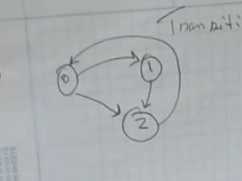

I have trouble describing matrix mulitplication to people. I often find that i make it more confusing than it needs to be...


If anyone thinks that have a good way to represent each step of the matrix multiplication, where each step shows an equation in variable form,
and would like to share it with me, please do. Its easier to represent a matrix in a program than it is to write it out, which is so strange.


If you really want me to show you how to do matrix multiplication i can, i just assumed it would be more confusing to have to look at if you
already have your own method in your head of how it should look and what works best for you.


This is something i was illustrating for Transitive Closure. First, *"What Is Transitive Closure?"*


Given a graph, the transitive closure is constructed by adding direct edges between nodes that are indirectly connected through other nodes. In other words, for every pair of nodes `A` and `B`, if there is a path from `A` to `B` (regardless of how many intermediate nodes are between them), the transitive closure will include a direct edge from `A` to `B`.

Formally: The transitive closure of a graph `G` is a graph `G'` where there is an edge from vertex `u` to vertex `v` in `G'`, if and only if there is a path from `u` to `v` in `G`.


To begin, we must analyze this cycle/flow chart...

And you create a table to fill in those paths where each number meet in the cycle/flow chart.
```
       dest ->
unnamed=  x | 0 | 1 | 2
      src 0 | 0 | 1 | 1
       |  1 | 0 | 0 | 1
       |  2 | 1 | 0 | 0
```
You take that and put it inside of a matrix called `adj1` *(excluding the very first row and column)*
```
adj1=  0 | 1 | 1
       0 | 0 | 1
       1 | 0 | 0
```
`adj1` multiplied by itself (which requires doing matrix multiplication)

This would imply the following steps: `row(0,1,1) * column(0,0,1) = ax + by + cz ` *(ax, by, cz.. im having represent each multiplication step, which leads to the subsequent addition step... thats what you do in matrix multiplication)*

`row(0,1,1) * column(0,0,1) = ax + by + cz`
`0*0=0`, `1*0=0`, `1*1=1` so row1 and col1 ` = ax+by+cz = 0 + 0 + 1    = 1`
```
adj2=  1 |   |
         |   |
         |   |
```
And then youd fill in the one.... Ill do one more so its clear where the next value goes...

`row(0,1,1) * column(1,0,0) = ax + by + cz`
`0*1=0`, `1*0=0`, `1*0=0` so row1 and col2 ` = ax+by+cz = 0 + 0 + 0    = 0`
```
adj2=  1 | 0 |
         |   |
         |   |
```
In conclusion, the resulting matrix would be showing you if its possible to make a certain maneuver between a given source and dest, 1 meaning its possible, 0 meaning its not.


You use the term `adj` because of "adjacency matrices", whereby an adjacency matrix is a square matrix used to represent a finite graph. The elements of the matrix indicate whether pairs of vertices are adjacent or not in the graph.*


So even though we multiply this matrix by itself, the result is deducing whether or not those results in `adj2` would be adjacent to `adj1` or not.


And if you find that terribly confusing, then lets try this—what it would look like in a C program (w/ ANSI C89 style of for loops)
```
int main() {
    // Define two 3x3 matrices with the specified values
    int matrixA[3][3] = {
        {0, 1, 1},
        {0, 0, 1},
        {1, 0, 0}
    };
    
    int matrixB[3][3] = {
        {0, 1, 1},
        {0, 0, 1},
        {1, 0, 0}
    };
    
    int matrixC[3][3]; // Resultant matrix

    // Declare loop variables
    int i, j, k;

    // Initialize Matrix C to 0
    for (i = 0; i < 3; i++) {
        for (j = 0; j < 3; j++) {
            matrixC[i][j] = 0;
        }
    }

    // Print Matrix A
    printf("Matrix A:\n");
    for (i = 0; i < 3; i++) {
        for (j = 0; j < 3; j++) {
            printf("%d ", matrixA[i][j]);
        }
        printf("\n");
    }
    printf("\n");

    // Print Matrix B
    printf("Matrix B:\n");
    for (i = 0; i < 3; i++) {
        for (j = 0; j < 3; j++) {
            printf("%d ", matrixB[i][j]);
        }
        printf("\n");
    }
    printf("\n");

    // Matrix multiplication (matrixC = matrixA * matrixB)
    for (i = 0; i < 3; i++) {
        for (j = 0; j < 3; j++) {
            for (k = 0; k < 3; k++) {
                matrixC[i][j] += matrixA[i][k] * matrixB[k][j];
            }
        }
    }

    // Print Matrix C (the result of the multiplication)
    printf("Matrix C (Result of A * B):\n");
    for (i = 0; i < 3; i++) {
        for (j = 0; j < 3; j++) {
            printf("%d ", matrixC[i][j]);
        }
        printf("\n");
    }

    return 0;
}
```
The output would be:
```
Matrix A:
0 1 1
0 0 1
1 0 0

Matrix B:
0 1 1
0 0 1
1 0 0

Matrix C (Result of A * B):
2 1 1
1 0 1
0 1 1
```
