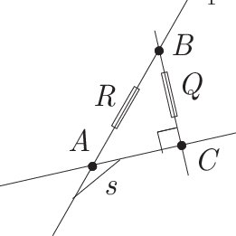

## Midian Larune

### Preamble
What is Midian Larune? The name originates from when I was 18, and I was looking for a middle ground between mathematics and natural language. It has become a combination of: monads for analysis and morphisms (procedures), and the extension into non-euclidean/complex numbers.

### Synopsis
There are several things I’m trying to achieve. Monads in my opinion are about the configuration of ideas (for more information on [monads and analysis, go here](monads.md)). Therefore I'm trying to create a formal, albeit natural way to structure thoughts during analysis and brainstorming (that is, a *mathematical structure* for arranging ideas). There's also those stages that require more precision and functionality, wherein understanding morphisms can offer insight into how we might go about said routines. I'm still refining both of these ideas. The alternative goal here is to extend towards complex numbers, which requires us walking through rational trig and other things. Rational trig involves quadrances and relationships between spreads and sides in isometric transformations such as dilation, rotation, etc.

At first I think we should identify the idea of a simple **state** (or potential state) of operands, as well as the **instrinsic value of operators** as they are contained within their own groups. In that way we will be prepared to go through the steps to reach these groups of relationships, and the extension into complex numbers (quaternions), however there are quite a few intermediate steps that fall in between, and it may take awhile until Midian Larune is finalized (however it may never be *truly complete*)


**Introduction**

So, what we're getting at is the intrinsic value of functions and their operators. I think it would be premature to study those values and transformations all at once. Therefore we will begin by logically deducing a simpler connection, and see if we can formalize our understanding of those operational mechanisms; That is, we need to resolve or find new ways of looking at everything, creating a distinction between *vague definitions* of a given transformation and a complete summary of its internal properties. They are all arbitrary components until we can zoom in and illustrate them more closely.

**Dimensionality**

In a similar vein, we should consider dimensionality and how each subsequent dimension encapsulates the characteristics of the dimensions preceding it. Its an averaging of each dimension that is creating the canonical value of those points inside. This'll be particularly relevant to our ideas. In the context of vectors, two vectors are <b>orthogonal</b> if their dot product is zero (note, i use the term orthogonal here over perpendicular since we are talking about vector relationships). Geometrically this still means they intersect to form a 90-degree angle. If we have two vectors `a=(a1,a2)` and `b=(b1,b2)` their dot product is defined as:

`a⋅b = (a)^2⋅(b)^2 − (a⋅b)^2`

When calculating rise/run, where in you need three parts, rise/run/hypotenuse... and the hypotenuse is stellated (cross-sectioned, or extending a polygons sides) with the adjacent side... therefore you're actually defining two, smaller rt triangles (i.e. a rectangle) that lives outside the ratio at the point where youd originally consider (0), where (0) is a defined region in this method of quadrance (the analogue of distance or length, defined as the square of the distance between two points)

**Morphisms composed over objects**

It should be noted, that although we are taking inspiration from category theory, that category theory inherently treats each object as a black box without an internal structure, and we actually care about that internal struct in midian larune. You can then think of category theory as being a higher level construct on top of a lower level, internal construct; We are interested in both perspectives. That is to say, we want to find the connection between mapping ideas as abstractions, and peering into the low level details, and learning about the language that leads back and forth through these things.

Our inspiration comes from the way we use **morphisms composed over objects** to structure and express ideas. A morphism describes a relationship between an object(s).
1. Internal Structure (defined using equations, functions, maybe even graphs or grammars)
2. External Mappings (morphisms like `f: A → B` for composability, that we'll elaborate on...)

First of all, suppose we want to start from the object itself, before the function; We can do that by defining `xbox_n`. For the sake of argument, we might say an xbox is a kind of tuple in a way:
```
xbox_n := (inputs, internal_structure, outputs)
```
Formally, we could also state that, `xbox_n := (O, M, D)`, wherein:
- O is a set of objects (like internal sub-ideas)
- M is a set of morphisms between them (which we'll explain what that is)
- D is a display or external interpretation function

note: The operator `:=` means *"is defined as"* and indicates that we are defining something, not just stating equality. We also called it `xbox_n` incase we later decide there's `xbox_0, xbox_1, xbox_2, ...`

Morphisms are kindve like functions, but more general. So you can ask yourself, **why are we presupposing a procedure** of some kind, as opposed to the individuated data?** First off, each idea or piece of data within said procedure is treated as an object, and the relationships between ideas are represented as structured mappings that define how one idea leads into another. That is a longer way of saying that, within or around each procedure is a potentially complex problem with many individual elements and possible consequences, and instead of pretending like we know the elements and those consequences, we start from a procedure that already assumes the problems require a procedure, and work our way up or down.

A procedure is just the simplest kind of unit we can use to encapsulate a problem, and we are taking advantage of that idea, in an organized realm. It also doesnt have to follow the rules category theory strictly speaking. It is more of a north star than it is an axiom-like thing we rely on.

It might make more sense to look at the page I made on [monads](monads.md) to understand where we are going w/ this, otherwise you can continue on...

Through composition, smaller ideas build into larger concepts, allowing for a clear progression of thought. This approach also naturally accommodates recursion, where an idea may be defined, albeit explicit in terms of itself. In the category of sets, objects are sets and morphisms are functions between sets.

A terminal object is an object that has exactly one morphism coming into it from every other object. In a situation that has recursion, we have two steps to create: (1) The Base Case (stopping condition), and (2) The Recursive Case (self-referential step). The base case is needed to prevent infinite recursion.
```
f: Idea1 → Idea2
```
This represents a direct relationship between two ideas, where `Idea1` transforms into `Idea2` through some function `f`. Or we can say that `Idea2` is a terminal object and all content (whatever the content of `Idea1` and `Idea2` is) has exactly one morphism leading to it.
```
Idea1 → Idea3
```
This is an example of composition where multiple transformations chain together to form a larger idea.
For example, if we have  `f: Idea1 → Idea2` and `g: Idea2 → Idea3`. Then, by composition:  `g ∘ f: Idea1 → Idea3`.
This means that `Idea3` emerges from `Idea1` through an intermediate step (`Idea2`).

In simpler terms, a composition may connect smaller ideas into larger structures (`Idea3` being the "larger" idea)

**Functorials**

They refer to constructions related to functors. A functor is a mapping between two categories that preserves the structure of those categories. In simpler terms, it’s a way to take objects and morphisms (the arrow or structure-preserving mapping between objects) from one category and systematically transform them into objects and morphisms in another category, while respecting how they are composed and related.

The term functorial is an adjective used to describe something that behaves in a manner consistent with functors—meaning it respects certain structural rules or relations, especially when transforming or mapping between different mathematical structures.

Now, regarding their relationship to operators: both functorials (via functors) and operators deal with transformations, but in different contexts. Operators typically refer to functions or maps within a single space (e.g., linear operators in a vector space), whereas functors work across categories of spaces.

For example, in functional analysis, an operator might transform a vector in a vector space. A functor, by contrast, would map not only between different vector spaces but also map how operators act between those spaces.

So, the connection between functorials and operators lies in the idea of transformation, but functorials take this to a higher level of abstraction by mapping not just individual elements (like vectors) but entire structures (like spaces and the functions between them).

**Interrelated Example**

Consider the following example to illustrate these connections. Also, notice we are stating these are *"equal to"* again, e.g. `f(x) = x`, and, as opposed to *"defined as"*, which means we are closer to the individual elements again.

You have two sets  `A={1,2,3}` and `B={x,y}`. A function `f:A→B` might be defined as `f(1)=x`,`f(2)=y`,`f(3)=x`
Now, consider a vector space `V` with vectors represented as
```
( a
  b 
```
A linear operator `T:V→V` (T is a function from V to V) might be defined as, e.g.
```
T(( a ))      ( (2*a)
    b     =     (3*b)
```
This operator doubles the first component and triples the second. If we take the category of vector spaces (Vect) and define a functor `F:Vect→Set`, it could map each vector space `V` to its underlying set of vectors, and each linear transformation `T` to a function `F(T)` that operates on these sets in a way that respects the linear structure.

**Commutative, Associative and History-Dependent Flow**

We have to go back to something we learned at the end of the introduction about commutative and associative operations: That is, subtraction, division and exponentiation were non associative, which meant the order in which **elements are grouped** and the order in which the operators are applied to said **grouped elements** is critical. And, it implied that you could get two or more different answers for equations that were supposedly non associative. The same is the case when we talk about non-commutative. Something that's non-commutative is different when you swap the positions of the numbers (or variables)

Lets look at an example; say we a multiplication, a subtraction and two concurrent multiplications, something like `5*4 - 5 * 5*3`, according to the rules of arithmetic, everything goes from left to right, even in cases where you have two multiplications in a row. If you solve the one on the far right, then it consumes a term that wouldve been involved in the center, `5*5`, which consumes a term that wouldve been subtracted, etc. (you get the idea). This cascade causes a chain of order results in a totally different result (i.e. `*Incorrect*`)

For something to be associative , such as when performing multiple multiplications, the way you group the numbers shouldnt change its result. For example, `a * (b * c)` is the same as `(a * b) * c`.

Matrix multiplication is associative only for **for groups of select operands**. For any three matrices, A, B, and C, the matrix product `A*B*C` can be performed by first multiplying A and B or by first multiplying B and C, i.e. `A*B*C = (A*B)C = A(B*C)`, but in general it is **non-commutative**. Say we have matrix product `A*B` ("A premultiplies B") is generally not equal to `B*A` ("B premultiplies A"). This means that if a sequence of translations, rotations and scalings is applied, the order in which the elementary transformation matrices appear is critical to determine the overall transformation. Only for some special cases, such as a sequence of transformations of the same kind (i.e. two translations or two rotations around the same axis), the multiplication of transformation matrices is commutative.

The "right-to-left" order of transformation matrices holds for column-matrix representations. In this representation, points such as `u` and `v` are represented as column vectors. Another convention is row-matrix representation in which points are represented as row vectors. The transposition of a matrix product is equivalent to the product of the transposition (T) of each matrix, w/ the order of multiplication reversed: `(A*B)^T = B^T * A^T` Thus, the transformation of vector `v` in columnar-matrix representation `u = M2*M1*v` equals `u = (v^T) * (M1^T) * (M2^T)` in row-matrix representation.

The "left-to-right" rule creates a history-dependent flow in how the expression is evaluated. Everything depends on everything that came before it, highlighting how the evaluation process accumulates in one direction—leading to a cascading effect on the result, even in sequences of operations with the same precedence (like multiplication or division).

**The State of Things** *(And the Intrinsic Value of Operators)*

There's an unusual/interesting perspective on operators (e.g. addition) that relates to both category theory and **states**; And, that is how you can **remove the object** or **obstruction** keeping two things separated, making it such that there is **empty space** between them, such that they have a **potential state of addition**. This of course is not the original application I had in mind for states when I was originally planning out the concept for **the state of things**. We can also consider **the state of thigns** to presuppose something about the kinds of conditions that we are working in, and try to abide by those conditions, like a *set and setting* type of thing. Basically, I'm thinking about complexity and initializing a situation; or the ways in which to immediately formulate better ideas on what we're doing, and **whether or not something matches a particular state**. Ergo, its like a way to **feel out a system's behavior when you're lost in complexity**. It is less about replacing proofs or systems, and more about building a tangential system. For matrix transformations for example, we could flag, e.g. *"Watch out, order matters here"*, early on, saving computation time. Problems involving, e.g. commutator magnitudes or patterns, could overlap with what **lie algebra's**, etc. attempt to do.

Alot of times we are crossing into the realms of [representational](https://en.wikipedia.org/wiki/Representation_theory) overlap, as well as the inherent limitations of certain fields to an extent. In conclusion, we are talking about ways to work out relationships. Numbers, geometry and the relationship between have all sorts of systemic issues, and so I'm trying to foresee what some of those are from a tangential perspective.

p.s. Sets and Order theory are interesting, though they may be peering at it from the sky (as general observations about order and such) but it lacks the kindve mastery of gaining insight about **the state of numbers, and knowing w/ more precision about a thing... Contending w/ matrices, transformations, and things like this is another area of contention.

**Msets** (multiplicity sets)

An mset (short for multiset) is like a set, except that it allows duplicate elements. It provides a way to represent mathematical objects like numbers, polynomials, etc.

- mset of zeros (`mset0`) is a collection of zeros, where each zero can have a multiplicity. This multiplicity indicates how many times that zero "appears" in the collection. For example, the mset {0, 0, 1, 2, 2, 2} represents a collection with two zeros, one one, and three twos.
- mset of naturals (`mset_nat`) is similar to an mset of zeros, but it contains positive integers (naturals) instead of zeros. For instance, the mset {1, 1, 2, 3, 3, 3} represents a collection with two ones, one two, and three threes.
- mset of polynomials (`mset_polynom`) is a collection of polynomials, where each polynomial can have a multiplicity.
- etc. (`mset_monomial`, `mset_binomial`, `mset_trinomial`, `mset_multinom`)

Monomials as we said, they are a single term like X, 5, -3, or what-have-you... And they are relevant in this context when we are talking about sets or msets and need to explain/build upon situations where its a non-monomial, or simply need to describe a set.

Each element in an mset has a multiplicity, which is a non-negative integer. The order of elements in an mset is not significant, and, in terms of equality, two msets are considered equal if they have the same elements w/ the same multiplicities. For example:

Consider the polynomial `p(x) = (x-1)^2(x+2)^3` (that is a power of a power, sometimes called nested powers, which follows the power to the power rule). This polynomial can be represented by the mset of its roots: {1, 1, -2, -2, -2}. Here, the root 1 has a multiplicity of 2, and the root -2 has a multiplicity of 3. On the other hand, a **list** and a **set** are different than msets in that they prescribe an actual value to each unique element, where the *order* of it is only important in a **list**.


Spreads or ratios can be thought of like protractors that have the same range on both sides, adjoining at the top... This implies two non-parallel lines, and the length (or simply "angle") in between those sides. Another way to say it is that the ratio of a spread is the vertical spread divided by the horizontal spread. When we calculate the dot product of two vectors in rational trigonometry, we are essentially comparing the product of their spreads. *note: if you follow through `R` passed B, that point off screen is D*

In simple terms, we dont treat any points as (0) (the spread of two *parallel* lines can still be called zero) therefore points are always in the context of an identifiable region of integers, and the spread can be considered a normal ratio (e.g. `1/2`) ... At most `1/1` is one whole turn, or by the least a spread will describe lines that are parallel, i.e. (`0`)

Points are colinear if they lie on the same line

`Spread (A, B, C) = Spread (A, B, D) + Spread (A, C, D)`

`Spread (A, B) + Spread (A, C) = Spread (A, D)`

Quadrance is a measure of distance (or relative separation) between two points. In the context of the spread `ABCD`, and if the coordinates of `A` are `x1,y1` and the coordinates of `B` are `x2,y2`, then the quadrance `Q` between `A` and `B` can be calculated using the distance formula:

`Q=(x2−x1)^2 + (y2−y1)^2`


*To be continued...*


**Complex Numbers**

You can draw the y-axis, labeling it "imaginary" and similarly an x-axis as "real" and this would be your complex plane. Plotting a number in between those would be a complex number.


**Quaternions** *(to be continued...)*

Within complex numbers, imaginary unit `i` (OR any variable which itself is considered complex when subjected to this situation) satisfies `i^2 = -1` as well as `-1^(1/2)` or `sqrt{-1}`... And so therefore `i` itself is not special, and is rather a conventional term to signify a variable. While they might seem abstract, imaginary numbers are just as real as any other numbers. They provide a way to represent points on the complex plane, which incorporates both real and imaginary components. Imaginary units, `i`, `j` and `k` satisfy `i^2 = j^2 = k^2 = -1`... they are also non-commutative in that `j, k, i` or `(-1)`, is not the same as `i, j, k` or `(1)`.. when presented as those forms of arithmetic.

`q = a + (b*i) + (c*j) + (d*k)` is a quaternion.
we can represent a quaternion as `q = s + v`, where: `s = a` is the scalar part (one dimension) and `v = (b*i) + (c*j) + (d*k)` is a vector part...

Quaternions are non-commutative and non-associative when under specific multiplication (or just specific "states")

SU(2) and quaternions share a connection because of the group of unit quaternions (denoted as `S^3`) which is isomorphic to SU(2). Or any matrix `A` for SU(2), has the determinant  `det(A)=1`. This means that mathematically, the structures of `S^3` and SU(2) are essentially the same, even though they arise from different contexts.

`S^3` is the set of points in `R^4` that satisfy the equation:

`x1^2 + x2^2 + x3^2 + x4^2 = 1`, or the coordinates in 4 dimensional space

If there is a "bijective mapping" (no two arrows collide) between two groups that preserves the group operation, then those groups are isomorphic. Something is isomorphic if its both injective and surjective. A function `f:A→B`  is injective if each element in set `A` maps to a unique element in set `B`, (or in other words, no two distinct elements in set `A` map to the same element in set `B`) Similarly, a function `f:A→B` is surjective if the function covers the entire range of set `B`. Mathematically, for every element `b` in `B`, there exists at least one element `a` in `A` such that `f(a)=b`.

We also want to work out how the observations made in the properties of operations applies to transpositions, such that we can differentiate those situations where we want a vague definition for a given tranformation, versus outputting a complete summary of the linear map. Anything after can then serve as a higher level area to work towards, such as spherical quaternion interpolation (SLERP), a piecewise function that applies to pairs of keyframes in a sequence (used to interpolate between two quaternions, a pair at a time, where the interpolation happens independently for each pair) Such that we can work towards working in a higher space, if that makes sense.

These type of things will have their own page, as they are higher level systems, and not part of the low level mathematics/connections we're trying to make. And as you can already tell, we've been weaving in and out of these higher level concepts, sortve-kindve **introducing** as much as we can so that its made clearer where the destination is, even though alot of the details still havent been filled in yet (note: again, alot of this is either very obscure in the public space, or its totally experimental, and as such there are insights missing that dont even exist yet, or that couldnt exist without the ideas I'm to put forward here in the future)

